# MEDUSA COMPLETE ADMIN GUIDE

**A Comprehensive Guide for Beginners**

---

## Table of Contents

1. [Introduction](#1-introduction)
2. [How Medusa Works](#2-how-medusa-works)
3. [First Login - Setup Checklist](#3-first-login---setup-checklist)
4. [Admin Dashboard Menu](#4-admin-dashboard-menu)
5. [Regions](#5-regions)
6. [Sales Channels](#6-sales-channels)
7. [Inventory](#7-inventory)
8. [Stock Locations](#8-stock-locations)
9. [Products](#9-products)
10. [Complete Product Creation Guide](#10-complete-product-creation-guide)
11. [Product Variants](#11-product-variants)
12. [Product Stock Management](#12-product-stock-management)
13. [Inventory Flow](#13-inventory-flow)
14. [Order Flow](#14-order-flow)
15. [Payment Flow](#15-payment-flow)
16. [Shipping Flow](#16-shipping-flow)
17. [Customer Flow](#17-customer-flow)
18. [Inventory + Sales Channel + Region Relationship](#18-inventory--sales-channel--region-relationship)
19. [Product Publishing Flow](#19-product-publishing-flow)
20. [Common Problems and Solutions](#20-common-problems-and-solutions)
21. [Real World Example](#21-real-world-example)
22. [Best Practices](#22-best-practices)
23. [Database Relationships](#23-database-relationships)
24. [API Flow](#24-api-flow)
25. [Developer Notes](#25-developer-notes)
26. [Complete Flow Diagram](#26-complete-flow-diagram)
27. [Checklists and FAQs](#27-checklists-and-faqs)

---

## 1. Introduction

### What is Medusa?

Medusa is an **open-source headless commerce platform** that allows businesses to build customizable e-commerce solutions. Think of it as the "engine" that powers your online store, managing everything from products and inventory to orders and payments.

**Key Points:**
- **Headless**: The backend (where data is managed) is separate from the frontend (what customers see)
- **Flexible**: Can be connected to any storefront (website, mobile app, IoT devices)
- **Modular**: Add or remove features as needed
- **Developer-friendly**: Built with modern technologies (Node.js, TypeScript, PostgreSQL)

### Why Choose Medusa?

| Feature | Traditional Platforms | Medusa |
|---------|----------------------|---------|
| Customization | Limited | Unlimited |
| Frontend Freedom | Locked to platform | Any technology |
| Hosting | Vendor-locked | Self-hosted or cloud |
| Cost | Monthly fees + transaction fees | Open-source (hosting costs only) |
| Scalability | Platform-dependent | Full control |

---

### How Medusa Architecture Works

Medusa consists of several components working together:

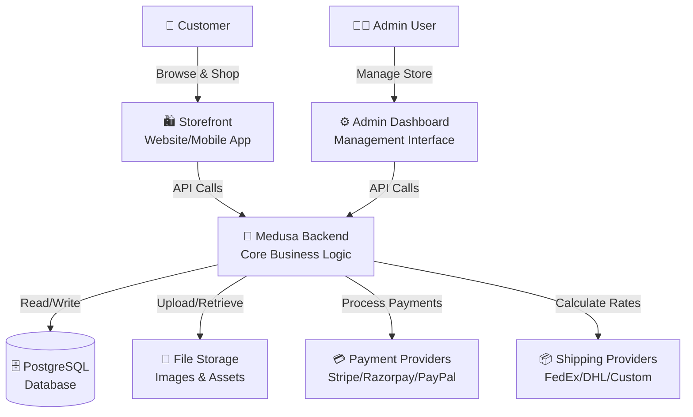


#### Component Breakdown

**1. Backend (Medusa Core)**
- The brain of your e-commerce system
- Handles all business logic
- Manages APIs for communication
- Processes orders, inventory, payments
- Built with Node.js and Express

**2. Admin Dashboard**
- Web interface for store management
- Where admins configure everything
- Manage products, orders, customers
- Built with React
- Accessed via browser (e.g., `http://localhost:9000/app`)

**3. Storefront**
- What customers see and interact with
- Can be built with any technology (Next.js, Gatsby, React Native, etc.)
- Connects to backend via APIs
- Completely customizable

**4. Database (PostgreSQL)**
- Stores all data permanently
- Products, orders, customers, inventory
- Relational database for data integrity

**5. APIs**
- **Admin API**: For admin operations (CRUD operations on products, orders, etc.)
- **Store API**: For customer-facing operations (browsing, checkout, etc.)
- RESTful architecture
- Authentication via JWT tokens

**6. Authentication**
- Admin users: Email + Password
- Customers: Email + Password or OAuth
- JWT tokens for secure sessions
- Role-based access control

**7. File Storage**
- Product images and media files
- Can use local storage or cloud (S3, Cloudinary, etc.)
- Optimized image serving

**8. Payment Providers**
- Integrations with payment gateways
- Stripe, Razorpay, PayPal, Square, etc.
- Handles payment capture, refunds
- Secure PCI-compliant processing

**9. Shipping Providers**
- Calculate shipping rates
- Integration with carriers (FedEx, UPS, etc.)
- Custom shipping logic
- Track shipments

---

## 2. How Medusa Works

### The Complete E-Commerce Flow

Let's understand how everything connects when a customer buys a product:

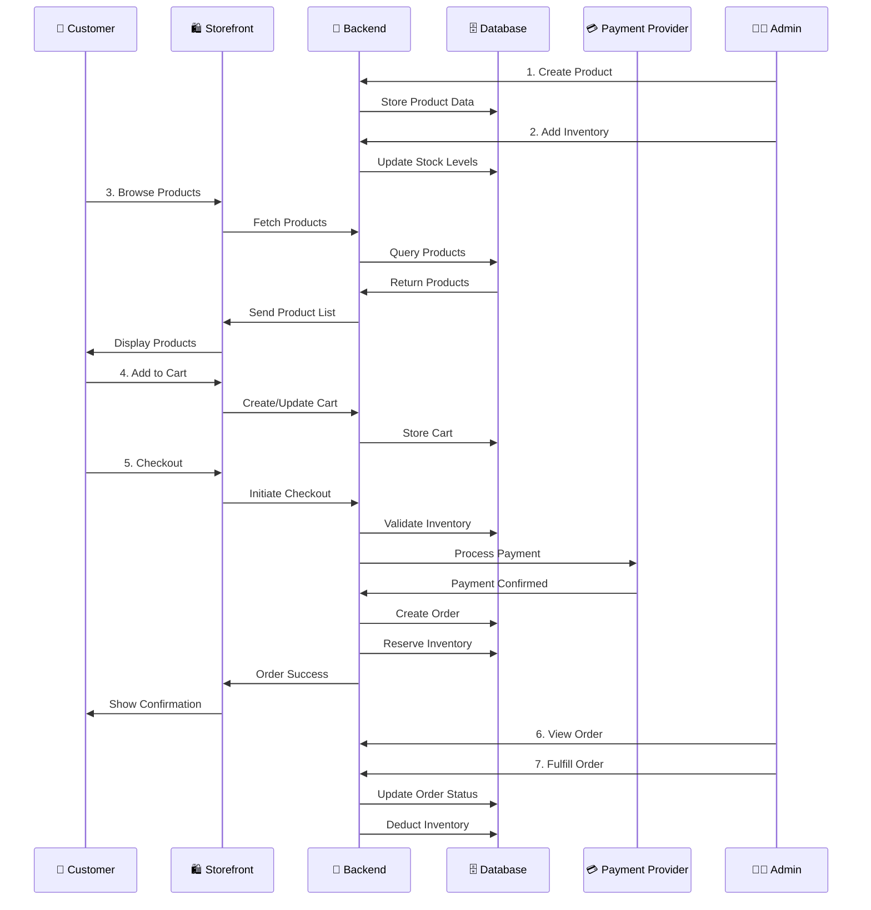

### Core Concepts Explained

#### **Products**
- Items you sell
- Can have multiple variants (sizes, colors)
- Contains: title, description, images, price
- Must be published to be visible

#### **Inventory**
- The quantity of products you have in stock
- Tracked per variant per location
- Automatically reserved when ordered
- Deducted when fulfilled


#### **Orders**
- Created when customer completes checkout
- Contains: customer info, products, payment, shipping
- Goes through lifecycle: pending → paid → fulfilled → completed

#### **Carts**
- Temporary storage of customer's selected products
- Created when first item is added
- Converted to order upon successful payment
- Automatically cleaned up after period of inactivity

#### **Regions**
- Geographic areas where you sell
- Defines: currency, tax rates, payment/shipping options
- Example: India (INR), USA (USD), Europe (EUR)
- **Critical**: Products must be available in region to be purchased

#### **Sales Channels**
- Different platforms where you sell
- Website, Mobile App, Marketplace (Amazon), POS, Wholesale
- Products can be assigned to specific channels
- Controls product visibility per channel

#### **Shipping**
- Delivery options for customers
- Configured per region
- Includes rates, zones, methods
- Can integrate with carriers for real-time rates

#### **Taxes**
- Automatically calculated based on region
- Can be inclusive or exclusive
- Configurable tax rates per region/product
- Supports tax overrides

#### **Customers**
- People who buy from your store
- Have accounts with: email, addresses, order history
- Can be grouped (VIP, wholesale, etc.)
- Guest checkout available


#### **Payments**
- How customers pay
- Multiple providers supported
- Handles authorization, capture, refunds
- Secure and PCI-compliant

### Complete Workflow Visualization

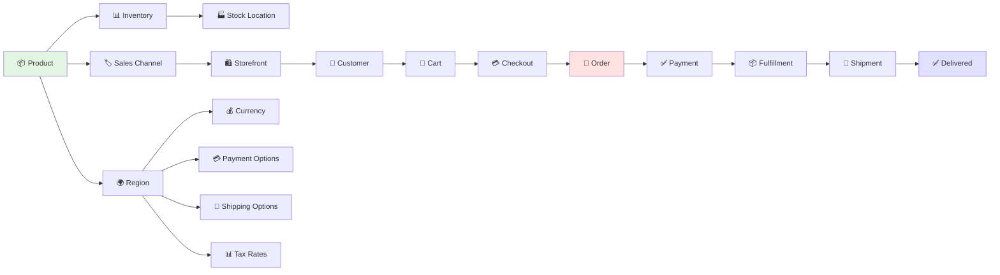

### Data Flow Summary

| Stage | What Happens | Database Changes |
|-------|--------------|------------------|
| **Setup** | Admin configures regions, channels, inventory | Creates regions, sales_channels, stock_locations |
| **Product Creation** | Admin adds products with variants | Creates products, product_variants |
| **Inventory Addition** | Admin sets stock levels | Creates inventory_items, inventory_levels |
| **Customer Browse** | Customer views products on storefront | Read-only queries to products |
| **Add to Cart** | Customer selects products | Creates/updates cart, cart_items |
| **Checkout** | Customer enters shipping/payment info | Updates cart with addresses |
| **Payment** | Customer pays | Creates order, payment, reserves inventory |
| **Fulfillment** | Admin ships products | Creates fulfillment, deducts inventory |
| **Completion** | Customer receives products | Updates order status to completed |

---

## 3. First Login - Setup Checklist

### Initial Configuration Sequence

When a company installs Medusa for the first time, the admin must configure the system in a **specific order**. Skipping steps or doing them out of order will cause problems.

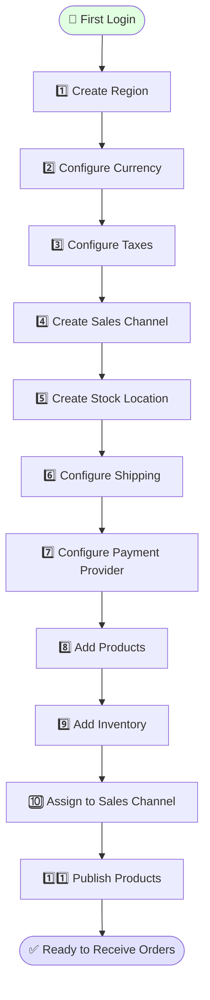

### Detailed Step-by-Step Guide

#### **Step 1: Create Region** 🌍
**Why Required:** Without a region, customers cannot checkout. Regions define where you sell, what currency to use, and how to tax/ship orders.

**What to Configure:**
- Region name (e.g., "India", "United States", "Europe")
- Countries included (e.g., India region includes IN)
- Default currency (INR, USD, EUR, etc.)

**Example:**
```
Region Name: India
Countries: India (IN)
Currency: INR (₹)
Tax Inclusive: Yes (common in India)
```

**Common Mistake:** Creating region without adding countries. Result: No customers can checkout!


#### **Step 2: Configure Currency** 💰
**Why Required:** Products need prices. Currency determines how prices are displayed and processed.

**What to Configure:**
- Primary currency for the region
- Exchange rates (if supporting multiple currencies)
- Currency formatting

**Example:**
```
India Region: INR (₹)
USA Region: USD ($)
EU Region: EUR (€)
```

**Common Mistake:** Setting wrong currency. A customer in India seeing prices in USD will be confused!

---

#### **Step 3: Configure Taxes** 📊
**Why Required:** Legal requirement. You must charge appropriate taxes based on customer location.

**What to Configure:**
- Default tax rate for region
- Tax inclusive vs. exclusive pricing
- Product-specific tax overrides (if needed)

**Example:**
```
India:
  GST: 18% (inclusive)
  Applied to: All products
  
USA:
  Sales Tax: Varies by state (exclusive)
  Applied at checkout
```

**Common Mistake:** Forgetting to enable taxes. Result: You're undercharging and losing money!

---

#### **Step 4: Create Sales Channel** 🏷️
**Why Required:** Medusa needs to know WHERE products should be visible. One product might be on your website but not your wholesale portal.

**What to Configure:**
- Channel name (e.g., "Website", "Mobile App", "Wholesale")
- Channel description
- Default channel (usually "Website")

**Example:**
```
Sales Channel 1: Website (public e-commerce)
Sales Channel 2: Mobile App (iOS/Android)
Sales Channel 3: Wholesale Portal (B2B customers)
```

**Common Mistake:** Not assigning products to any channel. Result: Products are invisible!


#### **Step 5: Create Stock Location** 🏭
**Why Required:** Medusa needs to know WHERE your inventory is physically stored. This enables multi-warehouse management.

**What to Configure:**
- Location name (e.g., "Mumbai Warehouse", "Delhi DC")
- Address details
- Link to sales channels

**Example:**
```
Stock Location 1: Mumbai Warehouse
  Address: 123 Industrial Area, Mumbai 400001
  Serves: Website, Mobile App
  
Stock Location 2: Delhi Distribution Center
  Address: 456 Logistics Park, Delhi 110001
  Serves: Wholesale Portal
```

**Common Mistake:** Not creating any stock location. Result: Cannot add inventory!

---

#### **Step 6: Configure Shipping** 📦
**Why Required:** Customers need to know delivery options and costs. Without shipping, no one can complete checkout.

**What to Configure:**
- Shipping profiles (Standard, Express, etc.)
- Shipping options with rates
- Geographic zones
- Delivery time estimates

**Example:**
```
India Region Shipping:

Option 1: Standard Delivery
  Rate: ₹50 flat
  Time: 5-7 days
  Zones: All India
  
Option 2: Express Delivery
  Rate: ₹150 flat
  Time: 2-3 days
  Zones: Metro cities only
```

**Common Mistake:** Forgetting to assign shipping profile to products. Result: "No shipping methods available" error!

---

#### **Step 7: Configure Payment Provider** 💳
**Why Required:** You need to accept payments! Without this, orders cannot be completed.

**What to Configure:**
- Payment provider (Stripe, Razorpay, PayPal, etc.)
- API keys (test and production)
- Supported payment methods (cards, UPI, wallets)
- Enable for specific regions

**Example:**
```
India Region:
  Provider: Razorpay
  Methods: Cards, UPI, Netbanking, Wallets
  Test Mode: Enabled (for testing)
  
USA Region:
  Provider: Stripe
  Methods: Cards, Apple Pay, Google Pay
```

**Common Mistake:** Using test keys in production. Result: Real payments fail!


#### **Step 8: Add Products** 📦
**Why Required:** Obviously, you need products to sell!

**What to Configure:**
- Product details (title, description)
- Images and thumbnails
- Pricing per region
- Options and variants
- Categories and collections

**Example:**
```
Product: Winter T-Shirt
  Description: Comfortable cotton t-shirt
  Price: ₹599 (India), $15 (USA)
  Variants: 
    - Small/Red
    - Small/Blue
    - Medium/Red
    - Medium/Blue
    - Large/Red
    - Large/Blue
```

**Common Mistake:** Skipping product descriptions. Result: Low conversion rates!

---

#### **Step 9: Add Inventory** 📊
**Why Required:** Even if you have a product, customers can't buy it without stock.

**What to Configure:**
- Select product variant
- Select stock location
- Enter available quantity
- Set low stock threshold (optional)

**Example:**
```
Product: Winter T-Shirt
Variant: Small/Red
Location: Mumbai Warehouse
Quantity: 100 units

Variant: Large/Blue
Location: Delhi DC
Quantity: 50 units
```

**Common Mistake:** Adding inventory to wrong location. Result: Orders fail!

---

#### **Step 10: Assign to Sales Channel** 🔗
**Why Required:** Products must be explicitly assigned to channels where they should be visible.

**What to Configure:**
- Select product
- Choose sales channels
- Save assignment

**Example:**
```
Product: Winter T-Shirt
  ✅ Website
  ✅ Mobile App
  ❌ Wholesale Portal (not available wholesale)
```

**Common Mistake:** Forgetting this step entirely. Result: Products exist but are invisible!


#### **Step 11: Publish Products** ✅
**Why Required:** Products are in "draft" status by default. Publishing makes them live.

**What to Configure:**
- Review all product details
- Ensure inventory is added
- Ensure sales channel is assigned
- Click "Publish"

**Before Publishing Checklist:**
- ✅ Product has images
- ✅ Product has description
- ✅ Product has price for all regions
- ✅ Product has inventory
- ✅ Product assigned to sales channel
- ✅ Shipping profile assigned
- ✅ Product categories/collections set

**Example Status Change:**
```
Draft ❌ → Published ✅
Status: Not visible → Visible on storefront
```

**Common Mistake:** Publishing without inventory. Result: Customers see product but can't buy it!

---

### Configuration Complete! 🎉

After completing all 11 steps:

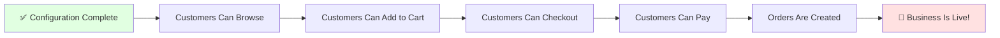

### Why This Order Matters

If you do steps out of order:

| Wrong Order | Problem |
|-------------|---------|
| Add products before creating region | Cannot set prices (no currency) |
| Add inventory before stock location | Cannot assign inventory to location |
| Publish before adding inventory | Customers see unavailable products |
| Assign to channel before creating channel | Cannot assign (channel doesn't exist) |
| Configure shipping before region | Cannot define shipping zones |

**The correct order ensures each step has the prerequisites it needs.**

---

## 4. Admin Dashboard Menu

The Medusa Admin Dashboard is your control center. Let's explore every menu in detail.

### Dashboard Overview

```
┌─────────────────────────────────────────────┐
│  🏠 Dashboard                               │  ← Main overview
├─────────────────────────────────────────────┤
│  📦 Orders                                  │  ← Manage customer orders
│  📦 Products                                │  ← Manage products & variants
│  📚 Collections                             │  ← Group products
│  🏷️ Categories                              │  ← Categorize products
│  📊 Inventory                               │  ← Manage stock levels
│  🏭 Stock Locations                         │  ← Warehouse management
│  📋 Reservations                            │  ← View reserved inventory
│  👤 Customers                               │  ← Customer database
│  🎁 Promotions                              │  ← Discounts & sales
│  🎫 Gift Cards                              │  ← Gift card management
│  🌍 Regions                                 │  ← Geographic config
│  🏷️ Sales Channels                          │  ← Platform management
│  👥 Users                                   │  ← Admin user management
│  ⚙️ Settings                                │  ← System configuration
│  🔑 API Keys                                │  ← Integration keys
│  🔄 Workflows                               │  ← Automation rules
│  📮 Shipping                                │  ← Delivery configuration
│  💳 Payments                                │  ← Payment setup
│  📊 Tax                                     │  ← Tax configuration
│  💰 Currencies                              │  ← Currency management
│  📡 Events                                  │  ← System event logs
└─────────────────────────────────────────────┘
```

---

### 🏠 Dashboard (Home)

**Purpose:** Quick overview of your store's performance

**What You See:**
- Recent orders
- Revenue statistics
- Top products
- Order status summary
- Quick actions

**When to Use:**
- Daily store health check
- Monitor recent activity
- Quick access to common tasks

**Example Use Case:**
```
Morning routine:
1. Open Dashboard
2. Check new orders (5 new orders overnight)
3. Check revenue (₹12,450 yesterday)
4. Notice low stock alert for popular item
5. Navigate to inventory to restock
```

**Common Mistakes:**
- ❌ Ignoring dashboard warnings
- ❌ Not checking daily

**Screenshot Placeholder:**
```
[📸 Dashboard showing order statistics, revenue graph, and recent orders]
```


---

### 📦 Orders

**Purpose:** Manage all customer orders from creation to delivery

**What You See:**
- List of all orders
- Order status (pending, paid, fulfilled, etc.)
- Customer details
- Order value
- Payment status
- Fulfillment status

**When to Use:**
- Daily order processing
- Handle customer queries
- Process refunds/returns
- Track fulfillment

**Key Features:**
1. **View Order Details:** See complete order breakdown
2. **Capture Payment:** Manually capture authorized payments
3. **Create Fulfillment:** Mark items as shipped
4. **Process Refunds:** Issue full or partial refunds
5. **Edit Order:** Add/remove items (if not fulfilled)
6. **Transfer Orders:** Move to different regions
7. **Cancel Order:** Cancel before fulfillment

**Order Lifecycle:**
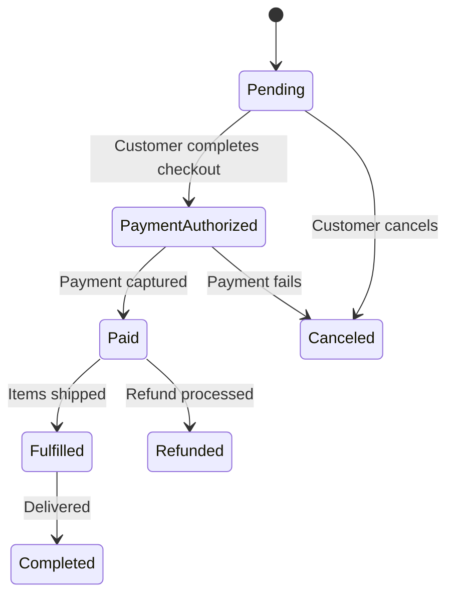

**Example Workflow:**
```
1. New order arrives → Status: Pending
2. Payment captured → Status: Paid
3. Admin creates fulfillment → Status: Fulfilled
4. Package delivered → Status: Completed
```

**Common Mistakes:**
- ❌ Capturing payment before confirming stock
- ❌ Creating fulfillment without shipping
- ❌ Not updating customers on status

**Screenshot Placeholder:**
```
[📸 Orders list with filters and order details panel]
```


---

### 📦 Products

**Purpose:** Create and manage all products in your catalog

**What You See:**
- Product list with thumbnails
- Product titles and descriptions
- Status (draft/published)
- Variant count
- Inventory status
- Sales channel assignments

**When to Use:**
- Adding new products
- Updating product information
- Managing product variants
- Setting prices
- Organizing products

**Key Features:**
1. **Create Product:** Add new products
2. **Edit Product:** Update details, images, pricing
3. **Manage Variants:** Add/edit size, color, etc.
4. **Set Prices:** Configure pricing per region
5. **Organize:** Add to collections/categories
6. **Publish/Unpublish:** Control visibility
7. **Duplicate:** Copy product to create similar one
8. **Delete:** Remove products

**Product Structure:**
```
Product (T-Shirt)
├── Basic Info
│   ├── Title
│   ├── Subtitle
│   ├── Description
│   ├── Handle (URL slug)
│   └── Material
├── Images
│   ├── Thumbnail
│   └── Gallery (multiple images)
├── Pricing
│   ├── India: ₹599
│   └── USA: $15
├── Variants
│   ├── Small/Red (SKU: TS-SM-RED)
│   ├── Small/Blue (SKU: TS-SM-BLU)
│   └── Medium/Red (SKU: TS-MD-RED)
├── Organization
│   ├── Collection: Summer Collection
│   ├── Category: Apparel > T-Shirts
│   └── Tags: casual, cotton, summer
└── Configuration
    ├── Sales Channels: Website, Mobile
    ├── Shipping Profile: Standard
    └── Status: Published
```

**Common Mistakes:**
- ❌ Missing product images (low conversions)
- ❌ Poor descriptions (customers don't understand product)
- ❌ Not setting variant SKUs (inventory tracking issues)
- ❌ Publishing without inventory (frustrates customers)

**Screenshot Placeholder:**
```
[📸 Product list and product detail edit form]
```


---

### 📚 Collections

**Purpose:** Group related products for marketing and merchandising

**What You See:**
- List of collections
- Products in each collection
- Collection metadata

**When to Use:**
- Seasonal campaigns (Summer Sale, Winter Collection)
- Product groupings (Best Sellers, New Arrivals)
- Promotional bundles

**Key Features:**
1. **Create Collection:** Define new product grouping
2. **Add Products:** Manually add/remove products
3. **Auto-Collections:** Rule-based product inclusion
4. **Custom Metadata:** Store additional collection data

**Example Collections:**
```
Collection: Summer 2024
  - Beach T-Shirts
  - Sunglasses
  - Summer Hats
  Products: 24
  
Collection: Best Sellers
  - Top 10 products by sales
  Auto-updated: Yes
  Products: 10
  
Collection: New Arrivals
  - Products added in last 30 days
  Auto-updated: Yes
  Products: 15
```

**Common Mistakes:**
- ❌ Too many collections (confuses customers)
- ❌ Empty collections (looks unprofessional)
- ❌ Not updating seasonal collections

---

### 🏷️ Categories

**Purpose:** Organize products in a hierarchical taxonomy

**What You See:**
- Category tree structure
- Product counts per category
- Category hierarchy (parent/child)

**When to Use:**
- Building site navigation
- Organizing large catalogs
- SEO optimization
- Filtering products

**Key Features:**
1. **Create Category:** Add categories
2. **Nested Categories:** Create subcategories
3. **Assign Products:** Link products to categories
4. **Reorder:** Change category order

**Example Category Structure:**
```
Apparel
├── Men
│   ├── T-Shirts (45 products)
│   ├── Shirts (32 products)
│   └── Pants (28 products)
├── Women
│   ├── Dresses (56 products)
│   ├── Tops (41 products)
│   └── Skirts (22 products)
└── Kids
    ├── Boys (34 products)
    └── Girls (38 products)

Electronics
├── Mobile Phones (120 products)
├── Laptops (67 products)
└── Accessories (234 products)
```

**Difference: Collections vs Categories**

| Aspect | Collections | Categories |
|--------|-------------|------------|
| Structure | Flat (no hierarchy) | Hierarchical (nested) |
| Purpose | Marketing/Campaigns | Navigation/Organization |
| Updates | Can be manual or automatic | Usually manual |
| Product Assignment | One product, many collections | One product, one category |
| Example | "Summer Sale" | "Apparel > Men > T-Shirts" |

**Common Mistakes:**
- ❌ Too deep category nesting (max 3 levels recommended)
- ❌ Inconsistent naming conventions
- ❌ Duplicate categories


---

### 📊 Inventory

**Purpose:** Track and manage stock levels across all locations

**What You See:**
- Inventory items (per product variant)
- Available quantity per location
- Reserved quantity (in pending orders)
- Incoming quantity (purchase orders)
- Inventory history

**When to Use:**
- Daily stock checks
- Restocking decisions
- Inventory adjustments
- Stock transfers between locations

**Key Features:**
1. **View Inventory:** See stock levels
2. **Adjust Inventory:** Increase/decrease stock
3. **Transfer Stock:** Move between locations
4. **View Reservations:** See what's allocated to orders
5. **Inventory History:** Track all changes

**Inventory Item Details:**
```
Product: Winter T-Shirt
Variant: Large/Blue
SKU: TS-LG-BLU

Mumbai Warehouse:
  Available: 85 units
  Reserved: 15 units (5 orders pending)
  Total: 100 units
  
Delhi DC:
  Available: 45 units
  Reserved: 5 units
  Total: 50 units
  
TOTAL AVAILABLE: 130 units
TOTAL RESERVED: 20 units
GRAND TOTAL: 150 units
```

**Inventory States:**

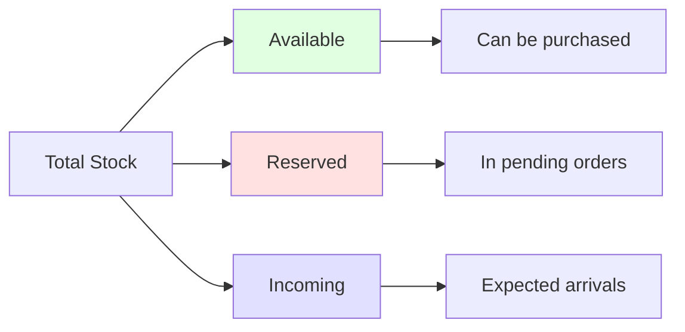

**Common Mistakes:**
- ❌ Not tracking inventory (overselling)
- ❌ Manual calculations (use system tools)
- ❌ Ignoring reservations (double-booking stock)
- ❌ Not setting low-stock alerts

**Screenshot Placeholder:**
```
[📸 Inventory levels across locations with adjustment panel]
```


---

### 🏭 Stock Locations

**Purpose:** Manage physical warehouse and fulfillment center locations

**What You See:**
- List of all locations
- Location addresses
- Inventory per location
- Sales channel assignments

**When to Use:**
- Adding new warehouses
- Managing multi-location inventory
- Assigning fulfillment sources
- Location-based routing

**Key Features:**
1. **Create Location:** Add warehouse/store
2. **Edit Location:** Update address and details
3. **Link to Sales Channels:** Control which locations serve which channels
4. **View Location Inventory:** See all products at location
5. **Disable/Enable:** Temporarily stop using a location

**Example Setup:**
```
Location 1: Mumbai Main Warehouse
  Address: Plot 123, MIDC, Mumbai 400001
  Type: Fulfillment Center
  Sales Channels: Website, Mobile App
  Total SKUs: 450
  Total Inventory: 15,234 units
  Status: Active
  
Location 2: Delhi Distribution Center
  Address: Sector 18, Gurgaon, Delhi 110001
  Type: Distribution Center
  Sales Channels: Wholesale Portal
  Total SKUs: 280
  Total Inventory: 8,450 units
  Status: Active
  
Location 3: Bangalore Retail Store
  Address: MG Road, Bangalore 560001
  Type: Retail Store (POS)
  Sales Channels: POS
  Total SKUs: 120
  Total Inventory: 2,100 units
  Status: Active
```

**Multi-Location Strategy:**
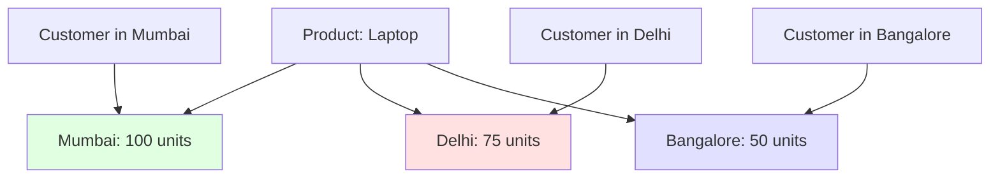

**Common Mistakes:**
- ❌ Single location for nationwide business (slow shipping)
- ❌ Not linking location to sales channel (orders fail)
- ❌ Poor location naming (confusing for team)

---

### 📋 Reservations

**Purpose:** View inventory temporarily allocated to pending orders

**What You See:**
- Reserved items per order
- Reservation status
- Location where reserved
- Expiry time (if applicable)

**When to Use:**
- Understanding why stock shows unavailable
- Investigating inventory discrepancies
- Managing abandoned carts

**How Reservations Work:**
```
Step 1: Customer adds product to cart
  → NO reservation yet

Step 2: Customer enters payment
  → Inventory RESERVED (typically for 10-15 minutes)

Step 3: Payment succeeds
  → Reservation converted to allocation
  → Inventory deducted on fulfillment

Step 4: Payment fails OR timeout
  → Reservation released
  → Inventory available again
```

**Example:**
```
Order #1234 (Pending Payment)
  Reserved Items:
    - T-Shirt Large/Blue × 2
      Location: Mumbai Warehouse
      Reserved: 10 minutes ago
      Expires: In 5 minutes
```

**Common Mistakes:**
- ❌ Confusing reserved with sold (it's not sold yet!)
- ❌ Manually adjusting reserved inventory (system manages this)


---

### 👤 Customers

**Purpose:** Manage customer database and relationships

**What You See:**
- Customer list
- Customer details (name, email, phone)
- Order history
- Addresses
- Customer groups

**When to Use:**
- Customer support queries
- Marketing campaigns
- Loyalty programs
- Order issues

**Key Features:**
1. **View Customer Profile:** Complete customer info
2. **Order History:** See all past orders
3. **Edit Details:** Update customer information
4. **Customer Groups:** Segment customers (VIP, Wholesale, etc.)
5. **Reset Password:** Help with login issues

**Customer Profile Example:**
```
Customer: Rajesh Kumar
Email: rajesh@example.com
Phone: +91-9876543210
Joined: Jan 15, 2024

Order History:
  - Order #1234 (₹2,499) - Delivered
  - Order #1156 (₹1,899) - In Transit
  - Order #1089 (₹3,450) - Delivered
  Total Orders: 3
  Total Spent: ₹7,848
  Average Order: ₹2,616

Addresses:
  Default: 123 MG Road, Bangalore 560001
  Office: 456 Tech Park, Bangalore 560037

Groups: VIP Customer, Email Subscriber
```

**Customer Segmentation:**
```
Group: VIP Customers
  Criteria: Total spent > ₹50,000
  Benefits: Free shipping, 10% discount
  Count: 45 customers

Group: Wholesale
  Criteria: Manual assignment
  Benefits: Wholesale pricing
  Count: 12 customers

Group: First-Time Buyers
  Criteria: Order count = 1
  Benefits: Second purchase coupon
  Count: 234 customers
```

**Common Mistakes:**
- ❌ Not responding to customer queries
- ❌ Poor segmentation (missed marketing opportunities)
- ❌ Not tracking customer lifetime value

---

### 🎁 Promotions

**Purpose:** Create and manage discounts, coupons, and sales campaigns

**What You See:**
- Active promotions
- Promotion codes
- Discount amounts
- Usage statistics
- Expiry dates

**When to Use:**
- Seasonal sales
- First-time customer discounts
- Loyalty rewards
- Abandoned cart recovery

**Key Features:**
1. **Create Promotion:** Set up discounts
2. **Promotion Types:** Percentage, fixed amount, free shipping
3. **Conditions:** Minimum purchase, specific products, customer groups
4. **Usage Limits:** Per customer, total uses
5. **Schedule:** Start and end dates

**Promotion Examples:**
```
Promotion: SUMMER20
  Type: Percentage Discount
  Value: 20% off
  Conditions:
    - Minimum purchase: ₹1,000
    - Valid on: All products
    - Excludes: Sale items
  Usage:
    - Per customer: 1 time
    - Total uses: Unlimited
  Duration: Jun 1 - Aug 31, 2024
  Status: Active
  
Promotion: FIRST100
  Type: Fixed Discount
  Value: ₹100 off
  Conditions:
    - First-time customers only
    - Minimum purchase: ₹500
  Usage:
    - Per customer: 1 time
    - Total uses: 1000 (567 used)
  Duration: Ongoing
  Status: Active
  
Promotion: FREESHIP
  Type: Free Shipping
  Value: Shipping cost waived
  Conditions:
    - Minimum purchase: ₹999
  Usage: Unlimited
  Duration: Ongoing
  Status: Active
```

**Common Mistakes:**
- ❌ No expiry dates (promotions run forever)
- ❌ Stacking issues (multiple discounts conflict)
- ❌ No usage tracking (budget overruns)


---

### 🎫 Gift Cards

**Purpose:** Sell and manage digital gift cards

**What You See:**
- Gift card list
- Card codes
- Balance
- Usage history

**When to Use:**
- Gift card sales
- Customer refunds (store credit)
- Loyalty rewards
- Corporate gifts

**Key Features:**
1. **Create Gift Card:** Generate new card
2. **Set Value:** Define card amount
3. **Track Usage:** See remaining balance
4. **Deactivate:** Disable lost/stolen cards

**Example:**
```
Gift Card: GC-2024-001234
  Value: ₹5,000
  Balance: ₹2,350
  Status: Active
  Issued: Jan 15, 2024
  Expires: Jan 15, 2025
  
  Usage History:
    - Order #1234: -₹1,500
    - Order #1456: -₹1,150
  Remaining: ₹2,350
```

---

### 🌍 Regions

**Purpose:** Define geographic markets and their configuration

**What You See:**
- Region list
- Countries in each region
- Currency settings
- Tax configuration
- Payment/shipping availability

**When to Use:**
- Expanding to new markets
- Configuring localization
- Setting up tax rules
- Managing multi-currency

**Key Features:**
1. **Create Region:** Add new market
2. **Add Countries:** Define geographic coverage
3. **Set Currency:** Primary currency for region
4. **Configure Tax:** Tax rates and rules
5. **Payment Providers:** Enable payment methods
6. **Shipping Options:** Configure delivery

**Region Configuration Example:**
```
Region: India
  Countries: India (IN)
  Currency: INR (₹)
  Tax: 18% GST (inclusive)
  Payment Providers:
    - Razorpay (Cards, UPI, Wallets)
    - Cash on Delivery
  Shipping Options:
    - Standard (5-7 days, ₹50)
    - Express (2-3 days, ₹150)
  Products: 450 available
  Status: Active

Region: United States
  Countries: USA (US)
  Currency: USD ($)
  Tax: State-based (exclusive)
  Payment Providers:
    - Stripe (Cards, Apple Pay, Google Pay)
  Shipping Options:
    - Standard (5-7 days, $5.99)
    - Express (2-3 days, $15.99)
    - Next Day ($29.99)
  Products: 380 available
  Status: Active
```

**Why Multiple Regions?**
```
Different regions need:
✓ Different currencies
✓ Different tax rules
✓ Different payment methods
✓ Different shipping options
✓ Different pricing
✓ Different legal requirements
```

**Common Mistakes:**
- ❌ One region for multiple currencies (confusing)
- ❌ Wrong tax configuration (legal issues)
- ❌ Not enabling payment methods (checkout fails)


---

### 🏷️ Sales Channels

**Purpose:** Manage different platforms where you sell products

**What You See:**
- Channel list
- Products per channel
- Channel status
- Orders per channel

**When to Use:**
- Multi-platform selling
- B2B vs B2C separation
- Marketplace integration
- Channel-specific catalogs

**Key Features:**
1. **Create Channel:** Add new sales platform
2. **Assign Products:** Control product visibility per channel
3. **Channel Analytics:** Track performance
4. **Enable/Disable:** Turn channels on/off

**Sales Channel Examples:**
```
Channel: Website (E-commerce)
  Platform: Next.js Storefront
  Products: 450 available
  Orders (30 days): 234
  Revenue: ₹3,45,600
  Status: Active
  
Channel: Mobile App (iOS/Android)
  Platform: React Native App
  Products: 450 available (same as website)
  Orders (30 days): 189
  Revenue: ₹2,67,800
  Status: Active
  
Channel: Amazon India
  Platform: Marketplace Integration
  Products: 120 selected products
  Orders (30 days): 45
  Revenue: ₹89,500
  Status: Active
  
Channel: Wholesale Portal
  Platform: B2B Storefront
  Products: 280 products (bulk pricing)
  Orders (30 days): 12
  Revenue: ₹5,67,000
  Status: Active
  
Channel: POS (Retail Stores)
  Platform: In-store point of sale
  Products: 150 products (limited catalog)
  Orders (30 days): 67
  Revenue: ₹1,23,400
  Status: Active
```

**Why Sales Channels Matter:**
```
Same product, different channels:

Product: Premium Laptop
├── Website: ₹45,000 (retail price)
├── Mobile App: ₹45,000 (retail price)
├── Amazon: ₹47,000 (higher to cover fees)
├── Wholesale: ₹38,000 (bulk pricing)
└── POS: ₹45,000 (retail price)
```

**Common Mistakes:**
- ❌ All products on all channels (no strategy)
- ❌ Not tracking channel performance
- ❌ Inconsistent pricing across channels

---

### 👥 Users

**Purpose:** Manage admin team members and their permissions

**What You See:**
- Admin user list
- User roles
- Access permissions
- Activity logs

**When to Use:**
- Adding team members
- Managing permissions
- Audit trails
- Security management

**Key Features:**
1. **Create User:** Add admin account
2. **Assign Roles:** Define permissions
3. **Manage Access:** Control what users can do
4. **Activity Logs:** Track user actions

**User Roles Example:**
```
User: admin@company.com
  Role: Super Admin
  Permissions: Full access to everything
  Status: Active
  Last Login: 2 hours ago
  
User: warehouse@company.com
  Role: Warehouse Manager
  Permissions:
    ✓ View orders
    ✓ Manage inventory
    ✓ Create fulfillments
    ✗ Edit products
    ✗ Manage payments
    ✗ View customer details
  Status: Active
  Last Login: 30 minutes ago
  
User: marketing@company.com
  Role: Marketing Manager
  Permissions:
    ✓ View products
    ✓ Edit products
    ✓ Manage promotions
    ✓ View customers
    ✗ Manage inventory
    ✗ Process refunds
  Status: Active
  Last Login: 1 hour ago
```

**Common Mistakes:**
- ❌ Giving everyone admin access (security risk)
- ❌ Sharing login credentials (audit issues)
- ❌ Not removing ex-employees (security breach)


---

### ⚙️ Settings

**Purpose:** System-wide configuration and preferences

**What You See:**
- Store details
- Business information
- Default configurations
- Integration settings

**Key Configurations:**
1. **Store Details:** Name, logo, contact info
2. **Return Settings:** Return window, policies
3. **Analytics:** Tracking codes
4. **Notifications:** Email templates
5. **API Settings:** Webhooks, integrations

---

### 🔑 API Keys

**Purpose:** Manage API credentials for integrations

**What You See:**
- Publishable keys (frontend)
- Secret keys (backend)
- Key status
- Usage tracking

**When to Use:**
- Connecting storefront to backend
- Third-party integrations
- Mobile app development
- Custom integrations

**Example:**
```
Publishable Key (Frontend):
  pk_live_abc123xyz789
  Used by: Storefront, Mobile App
  Can: Browse products, create carts
  Cannot: Access admin functions
  
Secret Key (Backend):
  sk_live_def456uvw012
  Used by: Backend services
  Can: Full API access
  Security: NEVER expose publicly!
```

**Common Mistakes:**
- ❌ Exposing secret keys (MAJOR security issue)
- ❌ Using test keys in production
- ❌ Not rotating keys periodically

---

### 🔄 Workflows

**Purpose:** Automate repetitive tasks and business processes

**What You See:**
- Workflow list
- Trigger conditions
- Actions
- Execution history

**Example Workflows:**
```
Workflow: Low Stock Alert
  Trigger: Inventory < 10 units
  Action: Send email to procurement team
  Status: Active
  
Workflow: Order Confirmation
  Trigger: Order created
  Action: Send confirmation email to customer
  Status: Active
  
Workflow: Abandoned Cart Recovery
  Trigger: Cart inactive for 24 hours
  Action: Send reminder email with discount code
  Status: Active
```

---

## 5. Regions

### What is a Region?

A **Region** in Medusa is a geographic market where you sell products. It bundles together everything needed to sell in that market:
- Currency
- Countries
- Tax rates
- Payment providers
- Shipping options

Think of it as a "sales territory" with its own rules and settings.

### Why Regions Are Required

Without regions, Medusa cannot:
- ❌ Display prices (no currency)
- ❌ Calculate taxes (no tax rules)
- ❌ Process payments (no payment provider)
- ❌ Ship orders (no shipping options)
- ❌ Complete checkout (all above needed)

**A customer can only buy products if:**
1. Their country is in a region
2. Products are available in that region
3. Region has payment and shipping configured

### Region Architecture

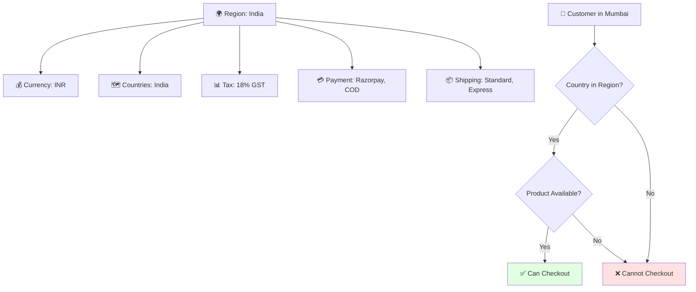

### Example 1: India Region

```
Region Name: India
Description: Indian market with INR pricing

Countries: 
  - India (IN)

Currency:
  Primary: INR (₹)
  Symbol: ₹
  Decimal Places: 2

Tax Configuration:
  Default Rate: 18% (GST)
  Type: Inclusive (price includes tax)
  Calculation: Automatic

Payment Providers:
  1. Razorpay
     - Credit/Debit Cards
     - UPI
     - Net Banking
     - Wallets (Paytm, PhonePe)
  
  2. Cash on Delivery
     - Available: Yes
     - Regions: All India
     - Max Amount: ₹50,000

Shipping Options:
  1. Standard Delivery
     - Rate: ₹50 (flat)
     - Time: 5-7 business days
     - Zones: All India
  
  2. Express Delivery
     - Rate: ₹150 (flat)
     - Time: 2-3 business days
     - Zones: Metro cities only
  
  3. Free Delivery
     - Rate: ₹0
     - Condition: Order > ₹999
     - Time: 5-7 business days

Product Pricing:
  T-Shirt: ₹599
  Laptop: ₹45,000
  Headphones: ₹2,499
```


### Example 2: USA Region

```
Region Name: United States
Description: US market with USD pricing

Countries:
  - United States (US)

Currency:
  Primary: USD ($)
  Symbol: $
  Decimal Places: 2

Tax Configuration:
  Type: State-based (varies)
  Calculation: Exclusive (added at checkout)
  Examples:
    - California: 7.25%
    - Texas: 6.25%
    - New York: 8.52%

Payment Providers:
  1. Stripe
     - Credit/Debit Cards
     - Apple Pay
     - Google Pay
     - ACH Bank Transfer

Shipping Options:
  1. Standard Ground
     - Rate: $5.99 (flat) or Free over $50
     - Time: 5-7 business days
  
  2. Express Shipping
     - Rate: $15.99
     - Time: 2-3 business days
  
  3. Next Day Delivery
     - Rate: $29.99
     - Time: Next business day
     - Available: Select cities only

Product Pricing:
  T-Shirt: $15
  Laptop: $899
  Headphones: $49
```

### Example 3: Europe Region

```
Region Name: Europe
Description: European market with EUR pricing

Countries:
  - Germany (DE)
  - France (FR)
  - Italy (IT)
  - Spain (ES)
  - Netherlands (NL)
  - Belgium (BE)
  - Austria (AT)

Currency:
  Primary: EUR (€)
  Symbol: €
  Decimal Places: 2

Tax Configuration:
  Type: VAT (varies by country)
  Calculation: Inclusive
  Examples:
    - Germany: 19%
    - France: 20%
    - Spain: 21%

Payment Providers:
  1. Stripe
     - Credit/Debit Cards
     - SEPA Direct Debit
     - Apple Pay
     - Google Pay
  
  2. PayPal
     - PayPal Account
     - Pay Later options

Shipping Options:
  1. Standard EU Shipping
     - Rate: €7.99 or Free over €75
     - Time: 5-10 business days
  
  2. Express EU Shipping
     - Rate: €19.99
     - Time: 2-4 business days

Product Pricing:
  T-Shirt: €18
  Laptop: €899
  Headphones: €59
```


### Multi-Region Product Pricing

The same product can have different prices in different regions:

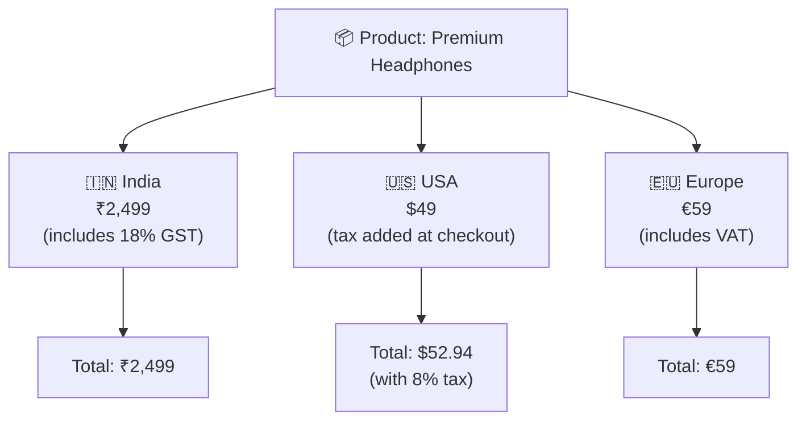

### Region Selection Flow

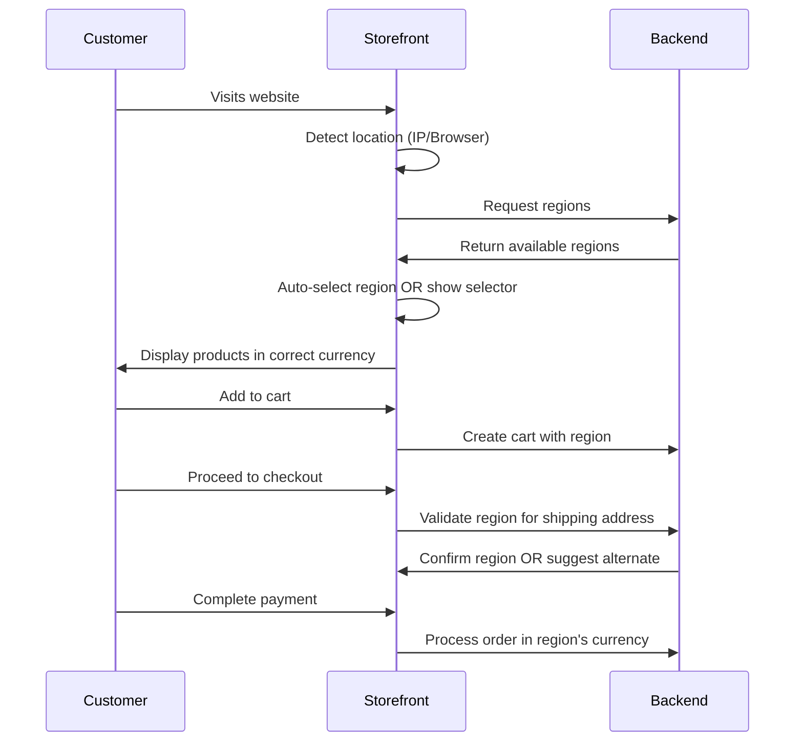

### Common Region Configuration Mistakes

| Mistake | Problem | Solution |
|---------|---------|----------|
| No countries added | Customers can't checkout | Always add at least one country |
| Wrong currency | Prices display incorrectly | Verify currency matches market |
| Missing payment provider | Payment fails | Configure at least one provider |
| No shipping options | Can't complete order | Add shipping methods |
| Tax not configured | Wrong pricing/legal issues | Set appropriate tax rates |
| Duplicate countries | Countries in multiple regions | Each country in one region only |

### Best Practices

✅ **DO:**
- Create separate regions for different currencies
- Configure tax correctly for each region
- Test checkout flow for each region
- Set appropriate shipping options
- Enable relevant payment methods

❌ **DON'T:**
- Put multiple currencies in one region
- Forget to add countries to region
- Leave tax at 0% (unless tax-free region)
- Copy region settings without adjusting
- Have overlapping countries in regions

---

## 6. Sales Channels

### What is a Sales Channel?

A **Sales Channel** is a platform or medium where you sell your products. Each channel represents a different customer touchpoint.

Think of it like different "storefronts" for your business, all powered by the same inventory and backend.

### Why Medusa Needs Sales Channels

**Problem without channels:**
- Same products for all platforms
- No control over where products appear
- Can't have different strategies per platform
- Can't track channel performance

**Solution with channels:**
- ✅ Choose which products appear where
- ✅ Different catalogs per platform
- ✅ Channel-specific analytics
- ✅ Flexible business models

### Sales Channel Examples

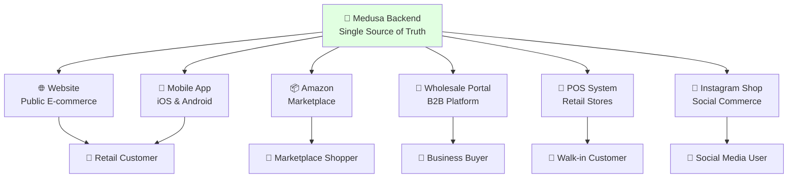

### Channel 1: Website (E-commerce)

```
Channel Name: Website
Type: B2C E-commerce
Technology: Next.js Storefront
URL: www.mystore.com

Product Strategy:
  - All consumer products
  - Full catalog (450 products)
  - Retail pricing
  - Marketing: SEO, Google Ads, Social Media

Target Audience:
  - General consumers
  - Age: 18-65
  - Shopping behavior: Research online, buy online

Features:
  - Product search and filters
  - User reviews and ratings
  - Wishlists and favorites
  - Promotions and discounts
  - Guest checkout available
  - Multiple payment options

Performance (30 days):
  Orders: 234
  Revenue: ₹3,45,600
  Avg Order Value: ₹1,477
  Conversion Rate: 2.3%
```


### Channel 2: Mobile App

```
Channel Name: Mobile App
Type: B2C Mobile Commerce
Technology: React Native
Platforms: iOS App Store, Google Play

Product Strategy:
  - Same as website (450 products)
  - Mobile-optimized images
  - Push notification promotions
  - App-exclusive deals

Target Audience:
  - Mobile-first shoppers
  - Age: 18-40
  - Shopping behavior: Quick purchases, on-the-go

Features:
  - One-tap checkout
  - Saved payment methods
  - Push notifications for offers
  - QR code scanning
  - Location-based offers

Performance (30 days):
  Orders: 189
  Revenue: ₹2,67,800
  Avg Order Value: ₹1,417
  Active Users: 5,600
```

### Channel 3: Amazon/Flipkart (Marketplace)

```
Channel Name: Amazon India
Type: Marketplace
Integration: Amazon MWS API

Product Strategy:
  - Selected products only (120 products)
  - Popular items with good margins
  - Competitive pricing
  - Amazon FBA for fulfillment

Target Audience:
  - Amazon shoppers
  - Price-conscious buyers
  - Prime members

Pricing Strategy:
  - Higher than website (to cover fees)
  - Example: Product costs ₹1,000 on website, ₹1,200 on Amazon
  - Reason: Amazon commission (15-20%)

Performance (30 days):
  Orders: 45
  Revenue: ₹89,500
  Avg Order Value: ₹1,989
  Amazon Fees: ₹15,300
```

### Channel 4: Wholesale Portal

```
Channel Name: Wholesale Portal
Type: B2B Platform
Technology: Custom B2B Storefront
Access: Invite-only, business verification required

Product Strategy:
  - Bulk-friendly products (280 products)
  - Volume pricing tiers
  - Minimum order quantities
  - Wholesale packaging

Target Audience:
  - Retailers
  - Distributors
  - Corporate buyers

Pricing Strategy:
  Tier 1: 10-49 units = 20% off
  Tier 2: 50-99 units = 30% off
  Tier 3: 100+ units = 40% off
  
  Example:
    Retail price: ₹1,000
    Wholesale (50 units): ₹700 each
    Total: ₹35,000

Features:
  - Bulk order interface
  - Credit terms (Net 30, Net 60)
  - Purchase order upload
  - Dedicated account manager
  - Invoice generation

Performance (30 days):
  Orders: 12
  Revenue: ₹5,67,000
  Avg Order Value: ₹47,250
  Top Buyer: XYZ Retail (₹1,23,000)
```


### Channel 5: POS (Retail Stores)

```
Channel Name: POS System
Type: In-store Point of Sale
Technology: Tablet-based POS app
Locations: 3 retail stores

Product Strategy:
  - Limited catalog (150 products)
  - High-turnover items
  - Display models available
  - Immediate pickup

Target Audience:
  - Walk-in customers
  - Want to see/touch product
  - Immediate need

Features:
  - Barcode scanning
  - Cash/card payments
  - Receipt printing
  - Real-time inventory sync
  - Store-to-store transfers

Performance (30 days):
  Orders: 67
  Revenue: ₹1,23,400
  Avg Order Value: ₹1,841
  Foot Traffic: 450 visitors
  Conversion Rate: 14.9%
```

### Channel 6: Instagram Shop

```
Channel Name: Instagram Shop
Type: Social Commerce
Integration: Facebook Commerce API

Product Strategy:
  - Photogenic products (80 products)
  - Trending items
  - Influencer collaborations
  - Limited editions

Target Audience:
  - Age: 18-35
  - Social media active
  - Visual shoppers

Performance (30 days):
  Orders: 34
  Revenue: ₹45,600
  Avg Order Value: ₹1,341
  Engagement: 12,000 likes, 450 shares
```

### How Products Are Assigned to Sales Channels

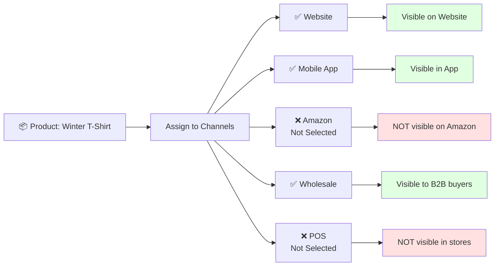

### Assignment Process

**Step-by-Step:**
1. Create/edit product in admin
2. Go to "Sales Channels" section in product form
3. Check channels where product should appear
4. Save product

**Result:**
- Product is ONLY visible on selected channels
- Customers on unselected channels won't see it
- API queries filter by channel automatically


### What Happens If Product Is Not Assigned to Any Channel?

```
Product Status: Published
Inventory: 100 units available
Sales Channels: NONE selected

Result: ❌ Product is invisible everywhere!

Customer Experience:
  Website: Product doesn't appear
  Mobile App: Product doesn't appear  
  Search: Product not in results
  Direct URL: 404 Not Found
  
Admin sees product ✅
Customers see product ❌
```

**This is a common mistake!** Always assign products to at least one sales channel.

### Channel Strategy Examples

#### **Example 1: Fashion Brand**
```
Product: Designer Dress
Price: ₹5,999

Channels:
  ✅ Website - Full price, all sizes
  ✅ Mobile App - App-exclusive 10% off
  ❌ Amazon - Not on marketplace (brand positioning)
  ❌ Wholesale - Not for resale
  ✅ Retail Stores - Try before buy
  
Strategy: Direct-to-consumer, control brand experience
```

#### **Example 2: Electronics Store**
```
Product: Bluetooth Speaker
Price: ₹2,499

Channels:
  ✅ Website - ₹2,499
  ✅ Mobile App - ₹2,499
  ✅ Amazon - ₹2,699 (to cover fees)
  ✅ Wholesale - ₹1,799 (bulk pricing)
  ✅ Retail Stores - ₹2,499
  
Strategy: Omnichannel, maximize reach
```

#### **Example 3: Wholesale Supplier**
```
Product: Industrial Equipment
Price: ₹50,000

Channels:
  ❌ Website - Not for retail
  ❌ Mobile App - Not for retail
  ❌ Amazon - Not suitable
  ✅ Wholesale - Only B2B sales
  ❌ Retail Stores - No retail presence
  
Strategy: B2B only, verified buyers
```

### Sales Channel Analytics

| Channel | Orders | Revenue | AOV | Conv. Rate | Top Product |
|---------|--------|---------|-----|------------|-------------|
| Website | 234 | ₹3,45,600 | ₹1,477 | 2.3% | Winter T-Shirt |
| Mobile App | 189 | ₹2,67,800 | ₹1,417 | 3.1% | Headphones |
| Amazon | 45 | ₹89,500 | ₹1,989 | N/A | Laptop Bag |
| Wholesale | 12 | ₹5,67,000 | ₹47,250 | N/A | Bulk Orders |
| POS | 67 | ₹1,23,400 | ₹1,841 | 14.9% | Phone Cases |
| **TOTAL** | **547** | **₹12,93,300** | **₹2,365** | **-** | **-** |

### Common Mistakes

| Mistake | Impact | Solution |
|---------|--------|----------|
| Not assigning to any channel | Product invisible | Always select at least one |
| All products on all channels | No strategy, confusion | Strategic channel selection |
| Same pricing across channels | Lost profit on Amazon | Adjust for marketplace fees |
| Not tracking channel performance | Can't optimize | Use analytics |
| Forgetting to update channels | New products invisible | Include in product creation workflow |

---

## 7. Inventory

### What is Inventory?

**Inventory** is the quantity of products you have available to sell. Medusa tracks inventory at the variant level per location.

### Core Inventory Concepts

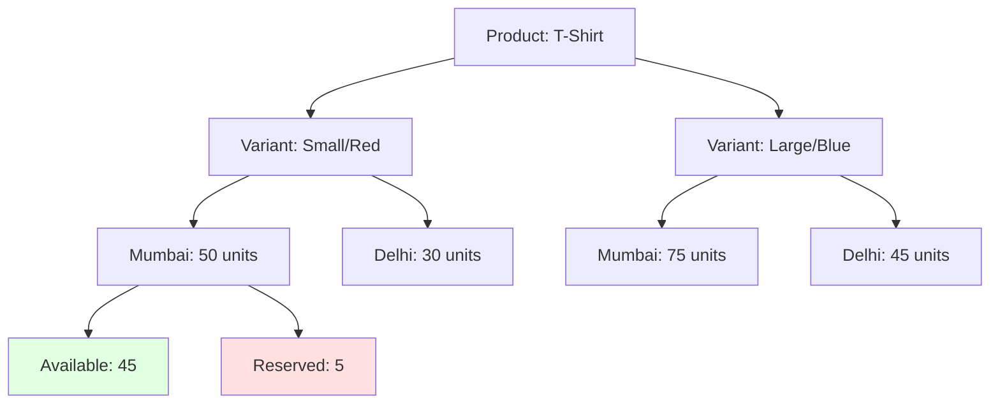

### Inventory Terms Explained

#### **1. Inventory Item**
- Represents stock for ONE product variant
- Tracked separately per location
- Has SKU for identification

**Example:**
```
Product: Winter T-Shirt
Variant: Large/Blue
SKU: TS-LG-BLU
Inventory Item ID: inv_01234
```

#### **2. Stock Location**
- Physical place where inventory is stored
- Warehouse, store, distribution center
- Products can be in multiple locations

**Example:**
```
Location 1: Mumbai Warehouse
Location 2: Delhi DC
Location 3: Bangalore Store
```

#### **3. Available Quantity**
- Stock that can be sold RIGHT NOW
- Not reserved or allocated
- What customers see as "in stock"

**Calculation:**
```
Available = Total Stock - Reserved - Allocated
```

#### **4. Reserved Quantity**
- Stock temporarily held for pending orders
- Customer hasn't paid yet (or payment processing)
- Released if payment fails or times out

**Example:**
```
Customer adds item to cart → NO reservation
Customer enters payment → Inventory RESERVED
Payment succeeds → Reserved becomes allocated
Payment fails → Reservation released
```

#### **5. Incoming Quantity**
- Stock expected to arrive
- Purchase orders in transit
- Not yet available for sale

**Example:**
```
Purchase Order #789
  Item: T-Shirt Large/Blue
  Quantity: 500 units
  Expected: Dec 15, 2024
  Status: In Transit
  
Current Available: 10 units
Incoming: 500 units
Future Available: 510 units
```


### Inventory Lifecycle

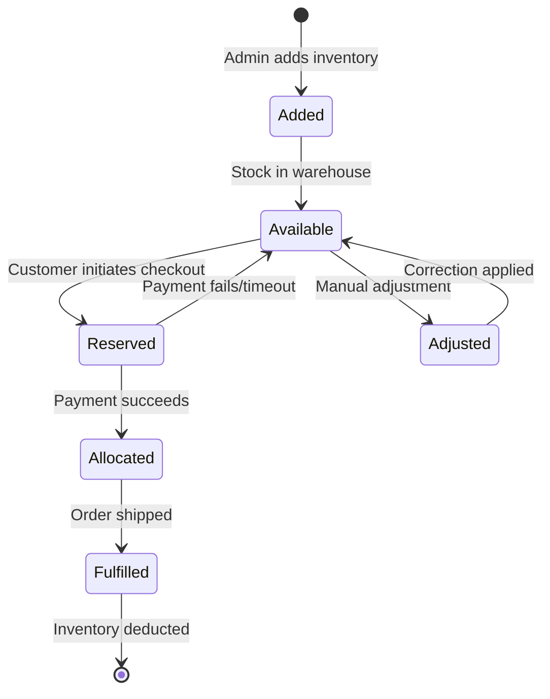

### Inventory Status Examples

#### **Example 1: Healthy Stock**
```
Product: Premium Headphones
Variant: Black
SKU: HP-BLK-001

Mumbai Warehouse:
  Total Stock: 200 units
  Available: 185 units
  Reserved: 15 units (8 pending orders)
  Incoming: 300 units (arriving Dec 20)
  
Status: ✅ Healthy Stock
Action: None needed
```

#### **Example 2: Low Stock**
```
Product: Winter Jacket
Variant: Large/Navy
SKU: WJ-LG-NVY

Delhi DC:
  Total Stock: 8 units
  Available: 3 units
  Reserved: 5 units
  Incoming: 0 units
  
Status: ⚠️ Low Stock Alert
Action: Reorder immediately
Recommendation: Set threshold at 20 units
```

#### **Example 3: Out of Stock**
```
Product: Bestseller T-Shirt
Variant: Medium/Red
SKU: TS-MD-RED

All Locations:
  Total Stock: 0 units
  Available: 0 units
  Reserved: 0 units
  Incoming: 500 units (arriving Dec 18)
  
Status: ❌ Out of Stock
Customer Message: "Back in stock Dec 18"
Action: 
  - Notify customers who waitlisted
  - Enable pre-orders (optional)
```

#### **Example 4: Over-Reserved (Problem!)**
```
Product: Gaming Console
Variant: Standard
SKU: GC-STD-001

Mumbai Warehouse:
  Total Stock: 10 units
  Available: -5 units ⚠️
  Reserved: 15 units
  
Status: 🔴 CRITICAL ISSUE
Problem: More reserved than available
Cause: System glitch or manual error
Action: 
  - Cancel newest orders OR
  - Transfer stock from other location OR
  - Emergency procurement
```


### Inventory Operations

#### **1. Adding Inventory**
```
Operation: Increase Stock
Use Case: New shipment arrived

Before:
  Available: 50 units
  
Action: Add 200 units
  Reason: Supplier delivery
  Reference: PO #1234
  
After:
  Available: 250 units
  
Logged: "Added 200 units - PO #1234" (timestamp, admin user)
```

#### **2. Adjusting Inventory**
```
Operation: Correction
Use Case: Physical count doesn't match system

System Shows: 100 units
Physical Count: 95 units
Discrepancy: -5 units

Action: Adjust to 95 units
  Reason: Damaged in storage
  
After:
  Available: 95 units
  
Note: Always document reason for auditing
```

#### **3. Transferring Inventory**
```
Operation: Location Transfer
Use Case: Rebalance stock between locations

From: Mumbai Warehouse
  Before: 150 units
  Transfer: -50 units
  After: 100 units

To: Delhi DC
  Before: 20 units
  Transfer: +50 units
  After: 70 units

Total: 170 units (unchanged)
Reference: Transfer #456
Status: In Transit (2 days)
```

#### **4. Reserving Inventory**
```
Operation: Automatic Reservation
Use Case: Customer initiating checkout

Trigger: Customer clicks "Place Order"
  
Action:
  1. Check availability
  2. Reserve required quantity
  3. Set expiry (15 minutes)
  
Before:
  Available: 100 units
  Reserved: 10 units
  
After:
  Available: 98 units (customer ordered 2)
  Reserved: 12 units
  
Expiry: If payment not completed in 15 min, release reservation
```

### Multi-Location Inventory

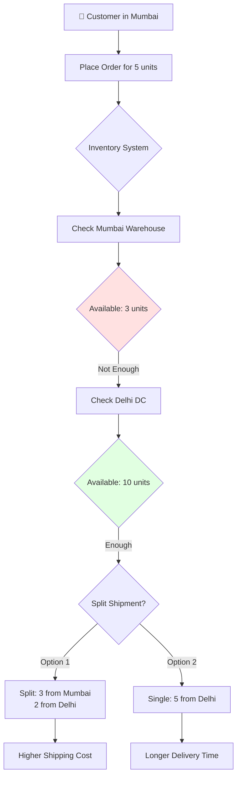

### Inventory Best Practices

✅ **DO:**
- Track inventory in real-time
- Set low-stock alerts (reorder point)
- Regular physical counts (cycle counting)
- Document all adjustments
- Use SKUs consistently
- Monitor reservations
- Plan for seasonal demand

❌ **DON'T:**
- Manually calculate availability
- Ignore discrepancies
- Skip stock counts
- Over-promise availability
- Forget about reserved stock
- Mix products without proper tracking

---

## 8. Stock Locations

### What is a Stock Location?

A **Stock Location** is a physical place where you store inventory:
- Warehouse
- Distribution Center
- Retail Store
- Fulfillment Center
- Third-party logistics (3PL) facility

### Why Stock Locations Matter

```
Without Stock Locations:
❌ Can't track where inventory is physically located
❌ Can't fulfill from optimal location
❌ Can't manage multiple warehouses
❌ Can't calculate accurate shipping times

With Stock Locations:
✅ Know exactly where each unit is stored
✅ Fulfill from nearest location (faster delivery)
✅ Balance inventory across locations
✅ Support multi-warehouse operations
```

### Stock Location Structure

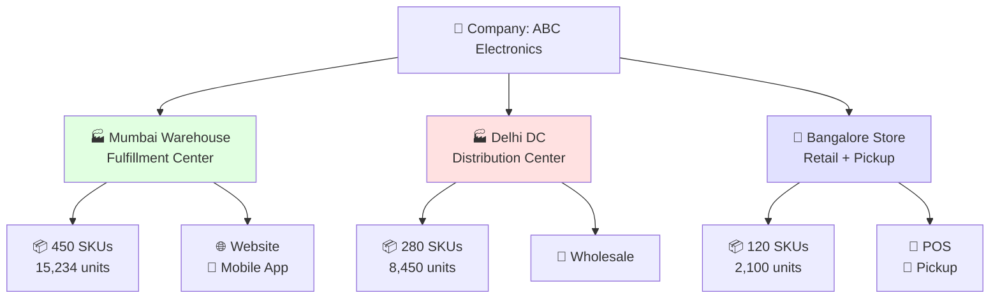

### Stock Location Examples

#### **Location 1: Main Warehouse**
```
Location Name: Mumbai Main Warehouse
Type: Fulfillment Center
Address: 
  Plot 123, MIDC Industrial Area
  Turbhe, Navi Mumbai
  Maharashtra 400705
  India

Contact:
  Manager: Ramesh Gupta
  Phone: +91-9876543210
  Email: mumbai.warehouse@company.com

Capacity:
  Total Space: 10,000 sq ft
  Current Usage: 7,500 sq ft (75%)
  SKU Count: 450 products
  Total Units: 15,234

Serves Sales Channels:
  ✅ Website (all orders in West India)
  ✅ Mobile App (all orders in West India)
  ❌ Wholesale (served by Delhi)
  ✅ Retail Stores (stock transfer)

Geographic Coverage:
  Primary: Maharashtra, Gujarat, Goa
  Secondary: Karnataka, Kerala, Tamil Nadu
  Shipping Time: 2-3 days (primary), 4-5 days (secondary)

Operating Hours:
  Monday-Saturday: 9 AM - 6 PM
  Sunday: Closed
  
Fulfillment Capacity: 150 orders/day
```


#### **Location 2: Distribution Center**
```
Location Name: Delhi Distribution Center
Type: Distribution Center + B2B Fulfillment
Address:
  Sector 18, Udyog Vihar
  Gurgaon, Haryana 122001
  India

Contact:
  Manager: Priya Sharma
  Phone: +91-9876543211
  Email: delhi.dc@company.com

Capacity:
  Total Space: 15,000 sq ft
  Current Usage: 9,000 sq ft (60%)
  SKU Count: 280 products (wholesale items)
  Total Units: 8,450

Serves Sales Channels:
  ❌ Website (served by Mumbai)
  ❌ Mobile App (served by Mumbai)
  ✅ Wholesale Portal (all B2B orders)
  ❌ Retail Stores

Geographic Coverage:
  Primary: Delhi NCR, Punjab, Haryana, UP
  Secondary: Rajasthan, MP, J&K
  Shipping Time: 1-2 days (primary), 3-4 days (secondary)

Operating Hours:
  Monday-Saturday: 8 AM - 8 PM
  Sunday: Closed

Fulfillment Capacity: 50 bulk orders/day
Special: Handles large B2B orders, palletized shipping
```

#### **Location 3: Retail Store**
```
Location Name: Bangalore Retail Store
Type: Retail Store + Pickup Point
Address:
  45 MG Road
  Bangalore, Karnataka 560001
  India

Contact:
  Store Manager: Arun Reddy
  Phone: +91-9876543212
  Email: bangalore.store@company.com

Capacity:
  Total Space: 2,000 sq ft
  Display Area: 1,500 sq ft
  Storage: 500 sq ft
  SKU Count: 120 products (curated selection)
  Total Units: 2,100

Serves Sales Channels:
  ✅ POS (in-store sales)
  ✅ Website (click-and-collect orders)
  ✅ Mobile App (click-and-collect orders)
  ❌ Wholesale

Operating Hours:
  Monday-Sunday: 10 AM - 9 PM
  Public Holidays: 12 PM - 6 PM

Daily Traffic: ~50 walk-in customers
Conversion Rate: 15%
Daily Orders: ~8 (in-store) + 5 (pickup)
```


### How Stock Locations Work

#### **Scenario: Customer Orders Product**

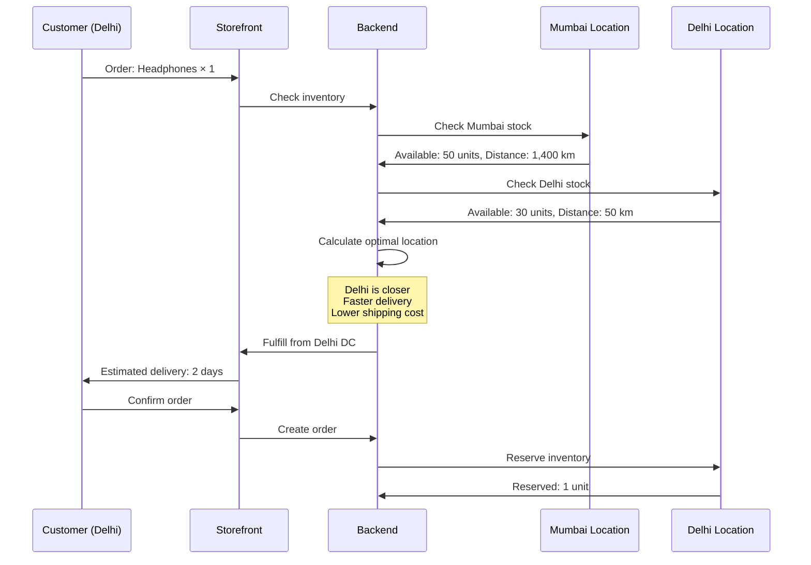

#### **Fulfillment Strategy**

**Option 1: Nearest Location (Default)**
```
Customer Location: Delhi
Product: Laptop

Available Locations:
  1. Delhi DC: 10 units, Distance: 50 km
  2. Mumbai Warehouse: 25 units, Distance: 1,400 km

Selected: Delhi DC
Reason: Closest, faster delivery, lower cost
Delivery Time: 1-2 days
Shipping Cost: ₹50
```

**Option 2: Availability-Based**
```
Customer Location: Pune
Product: Limited Edition Item

Available Locations:
  1. Mumbai Warehouse: 0 units, Distance: 150 km
  2. Delhi DC: 5 units, Distance: 1,400 km

Selected: Delhi DC
Reason: Only location with stock
Delivery Time: 4-5 days
Shipping Cost: ₹150
```

**Option 3: Split Fulfillment**
```
Customer Location: Chennai
Order: 
  - Laptop × 1
  - Headphones × 1

Available Locations:
  Mumbai: Laptop ✅, Headphones ❌
  Delhi: Laptop ✅, Headphones ✅

Option A: Single Shipment from Delhi
  Delivery: 4-5 days
  Shipping: ₹150
  
Option B: Split Shipment
  Laptop from Mumbai: 3-4 days, ₹100
  Headphones from Delhi: 4-5 days, ₹100
  Total Shipping: ₹200
  
Selected: Option A (better customer experience)
```


### Stock Location vs Inventory - What's the Difference?

This is a common point of confusion!

```
Stock Location:
  = Physical place (building, address)
  = WHERE inventory is stored
  = Example: "Mumbai Warehouse"

Inventory:
  = Quantity of products
  = HOW MUCH you have
  = Example: "100 units of Product X"

Relationship:
  Inventory EXISTS AT a Stock Location
  "100 units of Product X are at Mumbai Warehouse"
```

**Analogy:**
```
Stock Location = Bank Branch
Inventory = Money in that branch

You have money (inventory) at specific bank branches (locations).
You can transfer money between branches (transfer inventory between locations).
```

**Example:**
```
Product: Winter Jacket
Total Inventory: 200 units

Stock Location Breakdown:
  Mumbai Warehouse: 120 units (60%)
  Delhi DC: 50 units (25%)
  Bangalore Store: 30 units (15%)
  
Total: 200 units

The LOCATION is where the inventory lives.
The INVENTORY is what you're tracking.
```

### Stock Location Best Practices

✅ **DO:**
- Choose locations strategically (near customers)
- Name locations clearly (avoid abbreviations)
- Keep addresses updated
- Link locations to appropriate sales channels
- Monitor location performance
- Balance inventory across locations
- Plan for seasonal shifts

❌ **DON'T:**
- Create duplicate locations
- Use unclear naming ("Warehouse 1", "Warehouse 2")
- Forget to link to sales channels
- Keep all inventory in one location (single point of failure)
- Ignore location-specific costs

### Common Scenarios

#### **Scenario 1: Opening New Location**
```
Current: Mumbai only (serving all India)
Problem: Slow delivery to North India, high shipping costs

Solution: Open Delhi DC

Steps:
1. Create new stock location "Delhi DC"
2. Link to appropriate sales channels
3. Transfer inventory from Mumbai
4. Update fulfillment rules
5. Monitor performance

Result:
  - Faster delivery to North India
  - Lower shipping costs
  - Better customer satisfaction
```

#### **Scenario 2: Seasonal Inventory Shift**
```
Season: Summer approaching
Product: Summer T-Shirts
Current Distribution:
  Mumbai: 50 units
  Delhi: 50 units

Expected Demand:
  Mumbai (coastal): High
  Delhi (hot): Very High

Action: Proactive transfer
  Mumbai: 30 units (reduce)
  Delhi: 70 units (increase)

Result: Better stock alignment with demand
```

---

## 9. Products

### What is a Product?

A **Product** is an item you sell in your store. In Medusa, products can be simple (one version) or complex (multiple variants).

### Product Anatomy

```
Product
├── Basic Information
│   ├── Title (required)
│   ├── Subtitle (optional)
│   ├── Description (recommended)
│   ├── Handle (URL slug)
│   └── Material/Attributes
├── Media
│   ├── Thumbnail (main image)
│   └── Gallery (additional images)
├── Variants
│   ├── Variant 1 (e.g., Small/Red)
│   ├── Variant 2 (e.g., Large/Blue)
│   └── ...
├── Pricing
│   ├── Region-specific prices
│   └── Currency handling
├── Inventory
│   ├── SKU per variant
│   ├── Barcode
│   └── Stock levels
├── Physical Properties
│   ├── Weight
│   ├── Dimensions (L×W×H)
│   └── Shipping requirements
├── Organization
│   ├── Collections
│   ├── Categories
│   ├── Tags
│   └── Type
├── Configuration
│   ├── Sales Channels
│   ├── Shipping Profile
│   ├── Discountable (yes/no)
│   └── Status (draft/published)
└── Metadata (custom fields)
```

### Product Status

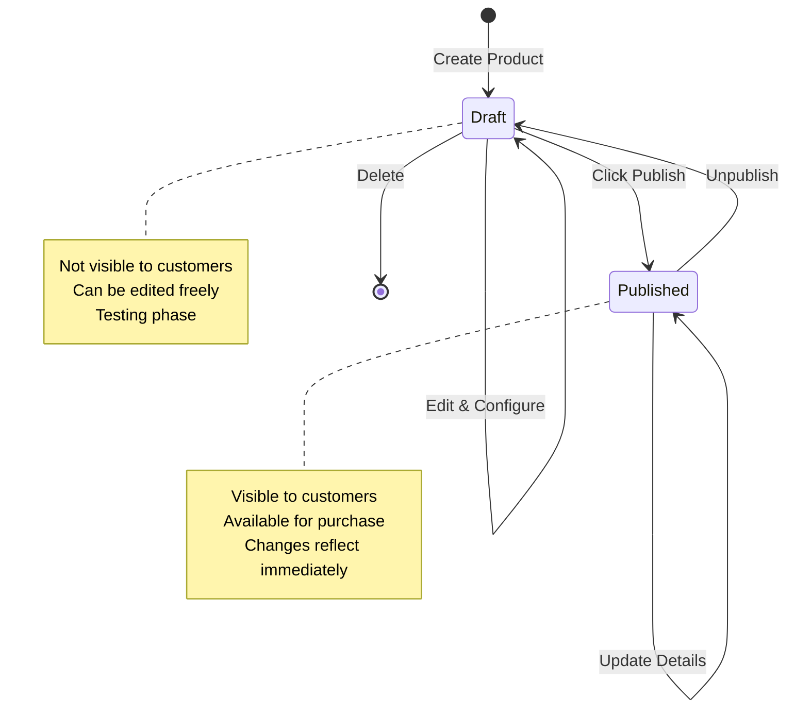

**Draft Status:**
- Product exists in system
- NOT visible on storefront
- Can be edited without affecting customers
- Used for: Preparing products, testing, inactive items

**Published Status:**
- Product visible on storefront
- Customers can browse and buy
- Changes are live immediately
- Used for: Active sales


### Product Fields Explained

#### **Title** (Required)
```
Purpose: Main product name
Examples:
  ✅ Good: "Premium Cotton T-Shirt"
  ✅ Good: "iPhone 15 Pro"
  ✅ Good: "Leather Laptop Bag - 15 inch"
  ❌ Bad: "tshirt" (too generic, no capitals)
  ❌ Bad: "AMAZING SUPER PRODUCT!!!" (too salesy)
  
Best Practices:
- Clear and descriptive
- Include key features
- Use proper capitalization
- 60 characters or less (for SEO)
```

#### **Subtitle** (Optional)
```
Purpose: Additional context
Examples:
  - "Comfortable all-day wear"
  - "256GB, Space Black"
  - "Professional grade with laptop compartment"
  
Use When:
- Adding key selling point
- Specifying variant details
- Highlighting feature
```

#### **Description** (Recommended)
```
Purpose: Detailed product information
Should Include:
- What it is
- Key features
- Materials/specifications
- Use cases
- Care instructions

Example:
"Our Premium Cotton T-Shirt is crafted from 100% organic cotton 
for maximum comfort. Features include:
- Breathable fabric perfect for Indian weather
- Pre-shrunk for consistent fit
- Reinforced stitching for durability
- Available in multiple colors and sizes

Care Instructions: Machine wash cold, tumble dry low"

Length: 150-300 words ideal
Format: Use line breaks, bullets for readability
```

#### **Handle** (URL Slug)
```
Purpose: URL-friendly product identifier
Auto-generated: Yes (from title)
Example:
  Title: "Premium Cotton T-Shirt"
  Handle: "premium-cotton-t-shirt"
  URL: www.store.com/products/premium-cotton-t-shirt

Rules:
- Lowercase only
- Hyphens instead of spaces
- No special characters
- Must be unique
- Should be SEO-friendly

Custom Handles:
  Title: "iPhone 15 Pro - 256GB"
  Auto Handle: "iphone-15-pro-256gb"
  Custom Handle: "iphone-15-pro-256" (shorter, cleaner)
```

#### **Thumbnail** (Main Image)
```
Purpose: Primary product photo
Requirements:
- Square ratio recommended (1:1 or 4:5)
- High resolution (minimum 1000×1000px)
- White or clean background
- Shows product clearly
- Well-lit

This image appears:
- Product listings
- Search results
- Cart
- Checkout
- Order confirmations

Format: JPG or PNG
Size: < 2MB recommended
```


#### **Gallery** (Additional Images)
```
Purpose: Show product from different angles
Recommended: 4-8 images

Should Include:
1. Front view
2. Back view
3. Side views
4. Detail shots (texture, stitching, etc.)
5. In-use photos (person wearing/using)
6. Size comparison
7. Packaging (if premium)

Example for T-Shirt:
1. Front flat lay
2. Back flat lay
3. Close-up of fabric texture
4. Model wearing (front)
5. Model wearing (side)
6. Tag/label detail

Best Practices:
- Consistent lighting across all images
- Same background
- High resolution
- Show scale
```

#### **SKU** (Stock Keeping Unit)
```
Purpose: Unique identifier for inventory tracking

Format Examples:
  System 1: Category-Size-Color
    "TS-SM-RED" (T-Shirt, Small, Red)
    "TS-LG-BLU" (T-Shirt, Large, Blue)
  
  System 2: Sequential
    "PROD-001-001" (Product 1, Variant 1)
    "PROD-001-002" (Product 1, Variant 2)
  
  System 3: Hierarchical
    "APP-MEN-TS-001" (Apparel, Men, T-Shirt, #1)

Rules:
- Must be unique across ALL products
- Consistent format
- Easy to understand
- Scannable (for barcode systems)
- No spaces

Why Important:
✓ Inventory tracking
✓ Order fulfillment
✓ Warehouse management
✓ Reporting and analytics
```

#### **Barcode**
```
Purpose: Physical scanning in warehouses/stores

Types:
- UPC (Universal Product Code): 12 digits
- EAN (European Article Number): 13 digits
- ISBN (for books): 10 or 13 digits
- Custom: Store-specific codes

Example:
  SKU: TS-SM-RED
  Barcode: 8901234567890 (EAN-13)
  
Usage:
- Scan during receiving
- Scan during picking/packing
- Scan at POS
- Inventory audits

Note: Can be same as SKU if using custom system
```

#### **Weight**
```
Purpose: Calculate shipping costs

Unit: grams (g) or kilograms (kg)

Examples:
  T-Shirt: 200g
  Laptop: 1.8kg (1800g)
  Headphones: 250g

Why Important:
- Shipping carriers charge by weight
- Customs declarations
- Packaging selection
- Handling requirements

Include packaging weight:
  Product: 1.5kg
  Box: 0.2kg
  Padding: 0.1kg
  Total Shipping Weight: 1.8kg
```


#### **Dimensions** (Length × Width × Height)
```
Purpose: Packaging and shipping calculations

Unit: centimeters (cm)

Examples:
  T-Shirt (folded in bag):
    L: 30cm, W: 25cm, H: 3cm
  
  Laptop (in box):
    L: 40cm, W: 30cm, H: 8cm
  
  Headphones (in box):
    L: 20cm, W: 18cm, H: 10cm

Why Important:
- Volumetric weight calculation
- Box selection
- Courier compatibility (size limits)
- Storage space planning

Note: Use packaged dimensions, not product dimensions
```

#### **Options** (Variant Dimensions)
```
Purpose: Define how product varies

Common Options:
- Size (Small, Medium, Large, XL)
- Color (Red, Blue, Black, White)
- Material (Cotton, Polyester, Silk)
- Style (Regular, Slim, Loose)
- Capacity (64GB, 128GB, 256GB)

Example Setup:
  Product: T-Shirt
  
  Option 1: Size
    Values: Small, Medium, Large, XL
  
  Option 2: Color
    Values: Red, Blue, Black, White

  Result: 4 sizes × 4 colors = 16 variants

Rules:
- Maximum 3 options per product
- Each option can have multiple values
- All combinations create variants automatically
```

#### **Collections**
```
Purpose: Group products for marketing

Examples:
- "Summer 2024"
- "Best Sellers"
- "New Arrivals"
- "Sale Items"
- "Featured Products"

A product can be in MULTIPLE collections:
  Product: Premium T-Shirt
  Collections:
    ✅ Summer 2024
    ✅ New Arrivals
    ✅ Featured Products

Use For:
- Homepage sections
- Marketing campaigns
- Email promotions
- Seasonal merchandising
```

#### **Categories**
```
Purpose: Organize catalog hierarchically

Examples:
  Category Path:
    Apparel > Men > T-Shirts
    Apparel > Women > Dresses
    Electronics > Computers > Laptops

A product belongs to ONE category:
  Product: Men's T-Shirt
  Category: Apparel > Men > T-Shirts ✅
  NOT ALSO: Apparel > Clothing ❌

Use For:
- Site navigation
- Product filtering
- SEO
- Catalog organization
```

#### **Tags**
```
Purpose: Flexible labeling for filtering

Examples:
- "organic"
- "eco-friendly"
- "handmade"
- "bestseller"
- "limited-edition"
- "cotton"
- "summer"

A product can have MULTIPLE tags:
  Product: Organic Cotton T-Shirt
  Tags:
    - organic
    - cotton
    - eco-friendly
    - summer
    - casual

Use For:
- Search filtering
- Product recommendations
- Internal organization
- Marketing segmentation
```


#### **Metadata** (Custom Fields)
```
Purpose: Store additional custom data

Examples:
  Key: manufacturer
  Value: "Nike"
  
  Key: care_instructions
  Value: "Machine wash cold, tumble dry low"
  
  Key: country_of_origin
  Value: "India"
  
  Key: warranty_period
  Value: "1 year"
  
  Key: eco_rating
  Value: "A+"

Use Cases:
- Custom product attributes
- Integration data
- SEO metadata
- Internal tracking
- Specialized filters

Format: Key-value pairs (JSON)
```

### Product Organization Summary

| Feature | Purpose | Quantity | Example |
|---------|---------|----------|---------|
| **Collections** | Marketing groups | Multiple per product | "Summer Sale" |
| **Categories** | Hierarchy/Navigation | One per product | "Apparel > Men > T-Shirts" |
| **Tags** | Flexible labels | Multiple per product | "organic", "cotton" |
| **Type** | Product classification | One per product | "T-Shirt" |
| **Sales Channels** | Visibility control | Multiple per product | "Website", "Mobile" |

---

## 10. Complete Product Creation Guide

### Step-by-Step: Creating Your First Product

Let's walk through creating a product from scratch, explaining every field and decision.

**Scenario:** You're adding a new "Winter T-Shirt" to your store.

### Step 1: Navigate to Products

```
Admin Dashboard
  → Click "Products" in sidebar
  → Click "Add Product" button (top right)
```

**Screenshot Placeholder:**
```
[📸 Products page with "Add Product" button highlighted]
```

### Step 2: Basic Information

```
Field: Title
Enter: "Winter T-Shirt"
Why: Clear, descriptive name customers will see

Field: Subtitle
Enter: "Warm and comfortable for cold weather"
Why: Adds context and selling point

Field: Handle
Auto-filled: "winter-t-shirt"
Action: Leave as is (or customize)
Why: Creates URL: /products/winter-t-shirt

Field: Material
Enter: "Cotton Blend"
Why: Product attribute for filtering

Field: Description
Enter:
"Stay warm and stylish with our Winter T-Shirt. Made from premium 
cotton blend fabric with thermal properties, this t-shirt is perfect 
for cold weather.

Features:
- 60% cotton, 40% polyester blend
- Thermal lining for warmth
- Breathable and moisture-wicking
- Pre-shrunk for lasting fit
- Available in multiple sizes and colors

Care Instructions:
Machine wash cold with like colors. Tumble dry low. Do not bleach."

Why: Detailed info helps customers make informed decisions
```


### Step 3: Images

```
Field: Thumbnail
Action: Upload main product image
File: winter-tshirt-front.jpg (1200×1200px, white background)
Why: This appears everywhere (listings, cart, etc.)

Field: Gallery
Action: Upload additional images
Files:
  1. winter-tshirt-front.jpg
  2. winter-tshirt-back.jpg
  3. winter-tshirt-detail.jpg (fabric closeup)
  4. winter-tshirt-model-front.jpg
  5. winter-tshirt-model-side.jpg

Why: Multiple angles help customers visualize product
```

**Screenshot Placeholder:**
```
[📸 Image upload interface with thumbnail and gallery]
```

### Step 4: Pricing

```
Section: Pricing
Region: India
  Currency: INR
  Price: 599.00
  Compare-at Price: 799.00 (optional - shows discount)
  
Region: USA  
  Currency: USD
  Price: 15.00
  Compare-at Price: 20.00

Region: Europe
  Currency: EUR
  Price: 18.00

Why different prices:
- Currency conversion isn't 1:1
- Market-specific pricing
- Shipping costs vary
- Competition differs

Tax Handling:
- India: Price includes 18% GST (inclusive)
- USA: Tax added at checkout (exclusive)
- Europe: Price includes VAT (inclusive)
```

### Step 5: Options & Variants

```
Options Configuration:

Option 1: Size
  Click "Add Option"
  Option Name: "Size"
  Values: Add "Small", "Medium", "Large", "XL"
  
Option 2: Color
  Click "Add Option"
  Option Name: "Color"
  Values: Add "Red", "Blue", "Black", "White"

Result: System generates 16 variants automatically
  Small/Red, Small/Blue, Small/Black, Small/White
  Medium/Red, Medium/Blue, Medium/Black, Medium/White
  Large/Red, Large/Blue, Large/Black, Large/White
  XL/Red, XL/Blue, XL/Black, XL/White
```

**Variants Table View:**

| Variant | SKU | Barcode | Price | Inventory |
|---------|-----|---------|-------|-----------|
| Small/Red | WT-SM-RED | 8901234567001 | ₹599 | (set later) |
| Small/Blue | WT-SM-BLU | 8901234567002 | ₹599 | (set later) |
| Small/Black | WT-SM-BLK | 8901234567003 | ₹599 | (set later) |
| Small/White | WT-SM-WHT | 8901234567004 | ₹599 | (set later) |
| Medium/Red | WT-MD-RED | 8901234567005 | ₹599 | (set later) |
| ... | ... | ... | ... | ... |

```
For Each Variant:

Field: SKU
Enter: "WT-SM-RED", "WT-SM-BLU", etc.
Why: Unique identifier for inventory tracking
Pattern: Product-Size-Color

Field: Barcode (optional)
Enter: EAN-13 codes or leave empty
Why: For warehouse scanning

Field: Manage Inventory
Toggle: ON
Why: Track stock levels

Field: Allow backorders
Toggle: OFF (for now)
Why: Don't allow purchases when out of stock
```


### Step 6: Physical Properties

```
For Each Variant (or set default for all):

Field: Weight
Enter: 250 (grams)
Why: Needed for shipping calculations

Field: Dimensions
  Length: 30 cm
  Width: 25 cm  
  Height: 3 cm (folded in packaging)
Why: Volumetric weight and box selection

Field: Requires Shipping
Toggle: ON
Why: Physical product needs delivery

Note: If all variants have same weight/dimensions, 
set once. Otherwise, customize per variant.
```

### Step 7: Organization

```
Field: Product Type
Enter: "T-Shirt"
Why: Classify product for reporting

Field: Collection
Select: 
  ✅ "Winter Collection"
  ✅ "New Arrivals"
Why: Marketing and homepage features

Field: Category
Select: "Apparel > Men > T-Shirts"
Why: Site navigation structure

Field: Tags
Enter: "winter", "cotton", "thermal", "casual"
Why: Filtering and search
```

### Step 8: Sales Channels

```
Section: Availability

Sales Channels:
  ✅ Website - Yes, show on main store
  ✅ Mobile App - Yes, show in app
  ❌ Amazon - No, not on marketplace
  ✅ Wholesale Portal - Yes, available for B2B
  ✅ POS - Yes, available in stores

Why selective:
- Amazon: Margins too thin for this product
- All other channels: Good fit
```

### Step 9: Shipping Profile

```
Field: Shipping Profile
Select: "Standard Shipping"

What this means:
- Product uses standard shipping rates
- Available shipping: Standard, Express
- Calculated based on region

Alternative profiles:
- "Free Shipping" - No shipping charge
- "Heavy Items" - Special rates
- "Express Only" - Only fast shipping
```

### Step 10: Additional Settings

```
Field: Discountable
Toggle: ON
Why: Allow promotional codes to apply

Field: Status
Options: Draft or Published
Select: "Draft" (for now)
Why: Review everything before making live

Field: Metadata (optional)
Add:
  Key: "season"
  Value: "Winter 2024"
  
  Key: "care_level"
  Value: "Easy"
```

### Step 11: Save Product

```
Action: Click "Save as draft"
Result: Product created but not visible to customers

What happens:
✅ Product stored in database
✅ Variants created
✅ All details saved
❌ NOT visible on storefront yet
❌ NO inventory added yet

Next Steps:
1. Add inventory
2. Review product
3. Publish when ready
```


### Step 12: Add Inventory

```
Navigate: Products → Winter T-Shirt → Inventory tab

For Each Variant:

Variant: Small/Red
  Location: Mumbai Warehouse
    Action: Click "Adjust inventory"
    Set quantity: 50 units
    Reason: "Initial stock"
  
  Location: Delhi DC
    Set quantity: 30 units
    Reason: "Initial stock"
    
  Total for Small/Red: 80 units

Variant: Medium/Blue
  Location: Mumbai Warehouse
    Set quantity: 75 units
  Location: Delhi DC
    Set quantity: 45 units
  Total: 120 units

... (repeat for all 16 variants)

Total Inventory Across All Variants: 1,200 units
Total Value: 1,200 × ₹599 = ₹7,18,800
```

### Step 13: Review Before Publishing

**Pre-Publish Checklist:**

```
✅ Product Details:
  ✅ Title is clear and descriptive
  ✅ Description is complete
  ✅ All specifications filled

✅ Images:
  ✅ Thumbnail uploaded
  ✅ Gallery has 4+ images
  ✅ Images are high quality

✅ Pricing:
  ✅ Prices set for all regions
  ✅ Prices are competitive
  ✅ Compare-at prices set (if applicable)

✅ Variants:
  ✅ All 16 variants created
  ✅ All SKUs are unique
  ✅ All have weight/dimensions

✅ Inventory:
  ✅ Stock added to all variants
  ✅ Inventory at multiple locations
  ✅ Quantities are correct

✅ Organization:
  ✅ Category assigned
  ✅ Collections selected
  ✅ Tags added

✅ Availability:
  ✅ Sales channels selected
  ✅ Shipping profile assigned
  ✅ Regions enabled

✅ Settings:
  ✅ Discountable: ON
  ✅ Status: Ready to publish
```

### Step 14: Publish Product

```
Action: Click "Publish Product" button

Confirmation Dialog:
  "Are you sure you want to publish this product?"
  "It will be visible to customers immediately."
  
  [Cancel] [Publish]

Click: "Publish"

Result:
  ✅ Status changed: Draft → Published
  ✅ Product visible on storefront
  ✅ Customers can search and find it
  ✅ Available for purchase
  ✅ Appears in collections
  ✅ Shows in category pages
```

**Screenshot Placeholder:**
```
[📸 Product status showing "Published" with green indicator]
```

### Step 15: Verify on Storefront

```
Go to storefront website

Test 1: Search
  Search for "Winter T-Shirt"
  ✅ Product appears in results

Test 2: Browse Category
  Navigate: Apparel → Men → T-Shirts
  ✅ Product appears in listing

Test 3: View Product Page
  Click on product
  ✅ Images load correctly
  ✅ Description is readable
  ✅ Price displays correctly
  ✅ Variants can be selected
  ✅ "Add to Cart" button enabled

Test 4: Add to Cart
  Select: Medium/Blue
  Click "Add to Cart"
  ✅ Item added successfully
  ✅ Inventory decremented (reserved)

Test 5: Checkout (use test mode)
  ✅ Product shows in cart
  ✅ Shipping calculated
  ✅ Tax applied correctly
  ✅ Payment processes
  ✅ Order created
```

### Complete! 🎉

Your product is now:
- ✅ Created
- ✅ Configured
- ✅ Inventoried
- ✅ Published
- ✅ Available for purchase

---

## 11. Product Variants

### Understanding Variants

**Variant** = A specific version of a product with unique characteristics

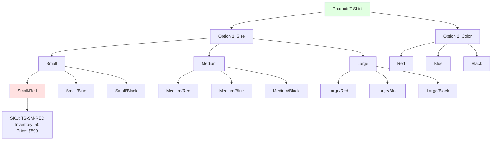

### Variant Examples

#### **Example 1: T-Shirt**
```
Product: Premium T-Shirt

Option 1: Size
- Small
- Medium
- Large
- XL

Option 2: Color
- Red
- Blue
- Black
- White

Total Variants: 4 sizes × 4 colors = 16 variants

Each variant:
- Has own SKU (TS-SM-RED, TS-MD-BLU, etc.)
- Has own inventory (tracked separately)
- Same price (usually)
- May have variant-specific images
```

#### **Example 2: Smartphone**
```
Product: Smartphone X

Option 1: Storage
- 64GB
- 128GB
- 256GB

Option 2: Color
- Space Black
- Silver
- Gold

Total Variants: 3 storage × 3 colors = 9 variants

Price Variation:
- 64GB: ₹30,000
- 128GB: ₹35,000
- 256GB: ₹40,000
(same across all colors)

Each variant:
- Different SKU
- Different price (based on storage)
- Different inventory
- Different weight (slightly)
```

#### **Example 3: Laptop**
```
Product: Professional Laptop

Option 1: Processor
- i5
- i7
- i9

Option 2: RAM
- 8GB
- 16GB
- 32GB

Option 3: Storage
- 256GB SSD
- 512GB SSD

Total Variants: 3 × 3 × 2 = 18 variants

Complex Pricing:
- Base (i5/8GB/256GB): ₹45,000
- Mid (i7/16GB/512GB): ₹65,000
- High (i9/32GB/512GB): ₹95,000

Note: Maximum 3 options per product in Medusa
```

### When to Use Variants vs Separate Products

| Use Variants When | Use Separate Products When |
|-------------------|----------------------------|
| Different sizes of same item | Completely different items |
| Different colors of same item | Different product categories |
| Different capacities | Different brands |
| Minor variations | Major functional differences |
| Share same description | Need different descriptions |
| Share same images (mostly) | Need completely different images |

**Examples:**

✅ **Use Variants:**
- T-Shirt in S/M/L/XL
- Phone in 64GB/128GB/256GB
- Shoes in different sizes
- Jeans in different colors

❌ **Don't Use Variants (use separate products):**
- T-Shirt vs Jeans (different products)
- Summer T-Shirt vs Winter T-Shirt (different features)
- Nike Shoes vs Adidas Shoes (different brands)
- iPhone vs iPad (different product lines)

---

## 12. Product Stock Management

### How Stock Works: Complete Example

```
Product: Laptop
Initial Stock: 100 units
Location: Mumbai Warehouse

Timeline:

Day 1, 10:00 AM - Initial State
├── Total Stock: 100 units
├── Available: 100 units
├── Reserved: 0 units
└── Status: ✅ In Stock

Day 1, 2:30 PM - Customer A starts checkout (2 units)
├── Total Stock: 100 units
├── Available: 98 units (decreased)
├── Reserved: 2 units (increased)
└── Reservation expires in 15 minutes

Day 1, 2:35 PM - Customer A completes payment
├── Total Stock: 100 units
├── Available: 98 units
├── Reserved: 0 units (released)
├── Allocated: 2 units (order confirmed)
└── Order #1234 created

Day 1, 3:00 PM - Customer B starts checkout (5 units)
├── Available: 93 units
├── Reserved: 5 units
└── Reservation expires in 15 minutes

Day 1, 3:18 PM - Customer B payment timeout (abandoned)
├── Available: 98 units (restored)
├── Reserved: 0 units
└── Reservation automatically released

Day 2, 10:00 AM - Admin ships Order #1234
├── Total Stock: 98 units (NOW deducted)
├── Available: 98 units
├── Allocated: 0 units
└── Fulfillment created

Day 3, 9:00 AM - New stock arrives (Purchase Order)
├── Total Stock: 98 + 50 = 148 units
├── Available: 148 units
└── Adjustment: "PO #789 - Supplier delivery"

Day 3, 11:00 AM - Inventory adjustment (damaged goods)
├── Total Stock: 148 - 3 = 145 units
├── Available: 145 units
└── Adjustment: "3 units damaged in warehouse"

Day 4, Order canceled before fulfillment
├── Order #1235 canceled (1 unit)
├── Allocated: -1 unit
├── Available: 146 units (returned to available)
└── Total Stock: 145 units (unchanged - wasn't fulfilled yet)
```

### Stock Flow Visualization

```mermaid
graph LR
    A[Initial Stock<br/>100 units] --> B[Customer Checkout<br/>Reserve 2 units]
    B --> C[Available: 98<br/>Reserved: 2]
    C --> D{Payment?}
    D -->|Success| E[Create Order<br/>Allocate 2 units]
    D -->|Fail/Timeout| F[Release Reservation<br/>Available: 100]
    E --> G[Fulfillment<br/>Ship 2 units]
    G --> H[Final Stock<br/>98 units]
    
    style A fill:#e1ffe1
    style H fill:#ffe1e1
```

### Stock Scenarios

#### **Scenario 1: Normal Purchase**
```
Initial: 100 available
Customer orders: 5 units
After reservation: 95 available, 5 reserved
After payment: 95 available, 5 allocated
After fulfillment: 95 available (5 deducted from total)
Final: 95 total, 95 available
```

#### **Scenario 2: Order Cancellation (Before Fulfillment)**
```
Initial: 100 available
Customer orders: 5 units
After payment: 95 available, 5 allocated
Customer cancels: Return 5 units
After cancellation: 100 available, 0 allocated
Final: 100 total, 100 available ✅ Stock returned
```

#### **Scenario 3: Order Cancellation (After Fulfillment)**
```
Initial: 100 units
Customer orders: 5 units
After fulfillment: 95 units (shipped)
Customer cancels: Cannot return stock automatically
Admin action: If returned, manually add 5 units
Final: Depends on return policy
```

#### **Scenario 4: Concurrent Orders (Race Condition)**
```
Initial: 10 available

10:00:00 - Customer A: Reserve 8 units
  Available: 2, Reserved: 8

10:00:03 - Customer B: Try to reserve 5 units
  System: ❌ Only 2 available
  Result: "Insufficient stock" error

10:00:15 - Customer A: Payment succeeds
  Available: 2, Allocated: 8

10:00:20 - Customer B: Retry with 2 units
  Available: 0, Reserved: 2 ✅ Success
```

#### **Scenario 5: Partial Fulfillment**
```
Order: 10 units of Product X
Available: 7 units only

Option 1: Reject order
  "Insufficient stock"

Option 2: Partial fulfillment
  Fulfill: 7 units now
  Backorder: 3 units (when restocked)
  
Implementation:
  Fulfillment 1: 7 units (immediate)
  Fulfillment 2: 3 units (when available)
```

---

## 13. Inventory Flow

```mermaid
sequenceDiagram
    participant A as Admin
    participant W as Warehouse
    participant S as System
    participant C as Customer
    participant O as Order
    
    A->>S: 1. Add Product
    Note over S: Product created (draft)
    
    W->>A: 2. Stock Arrives
    A->>S: Add Inventory (100 units)
    Note over S: Available: 100
    
    A->>S: 3. Publish Product
    Note over S: Product visible to customers
    
    C->>S: 4. Browse Products
    S->>C: Show product (100 available)
    
    C->>S: 5. Add to Cart
    Note over S: No reservation yet
    
    C->>S: 6. Initiate Checkout
    S->>S: Reserve 2 units
    Note over S: Available: 98<br/>Reserved: 2
    
    C->>S: 7. Complete Payment
    S->>O: Create Order #1234
    Note over O: Status: Paid<br/>Allocated: 2 units
    Note over S: Available: 98<br/>Reserved: 0
    
    A->>O: 8. View New Order
    A->>O: Create Fulfillment
    
    O->>W: 9. Pick & Pack
    W->>O: Ship Package
    
    O->>S: 10. Deduct Inventory
    Note over S: Total: 98<br/>Available: 98
    
    O->>C: 11. Delivery Confirmation
    Note over O: Status: Completed
```

### Detailed Inventory Lifecycle

#### **Phase 1: Setup (Admin)**
```
1. Create Product
   - Define product details
   - Add variants
   - Set prices
   - Status: Draft

2. Add Inventory
   - Select location
   - Enter quantity
   - Document source (PO #, supplier, etc.)
   - System creates inventory_item

3. Assign Sales Channels
   - Choose where product appears
   - Configure visibility

4. Publish Product
   - Status: Draft → Published
   - Product becomes visible
```

#### **Phase 2: Customer Shopping**
```
5. Browse Products
   - Customer views product
   - Sees "In Stock" status
   - Based on available inventory

6. Add to Cart
   - Item added to cart
   - NO inventory reservation yet
   - Inventory still available to others

7. View Cart
   - Customer reviews items
   - Still no reservation
   - Cart can be abandoned without impact
```

#### **Phase 3: Checkout & Payment**
```
8. Initiate Checkout
   - Customer clicks "Proceed to Checkout"
   - System checks inventory availability
   - If available: Reserve inventory
   - If not: Show error

9. Inventory Reserved
   - Quantity moved to "reserved"
   - Not available to other customers
   - Timer starts (typically 10-15 minutes)
   - If timeout: Reservation auto-released

10. Enter Shipping/Payment Info
    - Reservation still active
    - Timer continues

11. Complete Payment
    - Payment processed
    - If success: Create order, convert reservation to allocation
    - If fail: Release reservation
```

#### **Phase 4: Order Fulfillment**
```
12. Order Created
    - Status: Pending / Paid
    - Inventory allocated to order
    - Not yet deducted from total

13. Admin Views Order
    - Reviews order details
    - Verifies payment
    - Prepares for fulfillment

14. Create Fulfillment
    - Admin clicks "Fulfill"
    - Selects items to fulfill
    - Generates packing slip
    - Inventory NOW deducted

15. Warehouse Processes
    - Pick items from shelf
    - Pack in box
    - Print shipping label
    - Ship package

16. Update Tracking
    - Admin adds tracking number
    - Customer receives notification
    - Order status: Fulfilled

17. Delivery
    - Customer receives package
    - Order status: Completed
    - Inventory permanently deducted
```

#### **Phase 5: Exceptions**

**Exception A: Payment Fails**
```
Checkout → Reserve inventory
Payment fails
→ Release reservation immediately
→ Inventory available again
```

**Exception B: Order Canceled (Before Fulfillment)**
```
Order created → Inventory allocated
Customer cancels → Release allocation
→ Inventory available again
→ Refund processed
```

**Exception C: Order Canceled (After Fulfillment)**
```
Order fulfilled → Inventory deducted
Customer wants refund → Process refund
IF product returned → Manually add inventory back
→ Document as "Customer return - Order #1234"
```

**Exception D: Out of Stock During Checkout**
```
Customer adds last item to cart
Another customer completes purchase first
First customer tries to checkout
→ "Product no longer available"
→ Remove from cart or reduce quantity
```

---

## 14. Order Flow

```mermaid
stateDiagram-v2
    [*] --> CartCreated: Customer adds item
    CartCreated --> CheckoutInitiated: Proceed to checkout
    CheckoutInitiated --> PaymentAuthorized: Payment submitted
    PaymentAuthorized --> OrderPaid: Payment captured
    PaymentAuthorized --> PaymentFailed: Payment declined
    PaymentFailed --> [*]: Cart restored
    OrderPaid --> OrderFulfilled: Items shipped
    OrderFulfilled --> OrderCompleted: Delivered
    OrderPaid --> OrderCanceled: Cancel before ship
    OrderFulfilled --> OrderReturned: Return after delivery
    OrderCanceled --> [*]
    OrderReturned --> [*]
    OrderCompleted --> [*]
```

### Order States Explained

| State | Meaning | Next Actions | Inventory Status |
|-------|---------|--------------|------------------|
| **Pending** | Order created, awaiting payment | Capture payment | Reserved |
| **Paid** | Payment successful | Fulfill order | Allocated |
| **Fulfilled** | Items shipped | Wait for delivery | Deducted |
| **Completed** | Order delivered | Close order | Deducted |
| **Canceled** | Order canceled | Process refund | Returned (if before fulfillment) |
| **Returned** | Items returned | Restock inventory | Manual restock needed |

---

## 15. Payment Flow

```mermaid
sequenceDiagram
    participant C as Customer
    participant S as Storefront
    participant M as Medusa Backend
    participant P as Payment Provider
    participant B as Bank
    
    C->>S: Click "Pay Now"
    S->>M: Initiate payment
    M->>P: Create payment intent
    P->>S: Return payment form
    S->>C: Show payment form
    
    C->>P: Enter card details
    P->>B: Authorize payment
    B->>P: Authorization success
    P->>M: Payment authorized
    M->>M: Reserve inventory
    
    M->>P: Capture payment
    P->>B: Capture funds
    B->>P: Funds captured
    P->>M: Payment confirmed
    M->>M: Create order
    M->>S: Order success
    S->>C: Show confirmation
```

### Payment States

| State | Description | Can Refund? |
|-------|-------------|-------------|
| **Pending** | Payment not started | No |
| **Authorized** | Card charged but funds held | Partial |
| **Captured** | Funds transferred to merchant | Yes |
| **Refunded** | Money returned to customer | No (already refunded) |
| **Failed** | Payment declined | No |
| **Canceled** | Payment canceled before capture | No |

---

## 16. Shipping Flow

### Shipping Profile Structure

```
Product → Shipping Profile → Shipping Options → Rates

Example:
Product: T-Shirt
  ├── Shipping Profile: "Standard Goods"
      ├── Shipping Option: "Standard Delivery"
      │   └── Rate: ₹50 (flat) or ₹0 (if order > ₹999)
      └── Shipping Option: "Express Delivery"
          └── Rate: ₹150 (flat)
```

### Shipping Configuration

```
Region: India

Shipping Zone 1: Metro Cities
  Cities: Mumbai, Delhi, Bangalore, Chennai, Kolkata
  Standard: ₹50, 2-3 days
  Express: ₹150, 1-2 days

Shipping Zone 2: Tier 2 Cities
  Coverage: Other major cities
  Standard: ₹75, 3-5 days
  Express: ₹200, 2-3 days

Shipping Zone 3: Rest of India
  Coverage: All other areas
  Standard: ₹100, 5-7 days
  Express: Not available
```

---

## 17. Customer Flow

```mermaid
graph TB
    A[Customer Visits Site] --> B{Has Account?}
    B -->|No| C[Browse as Guest]
    B -->|Yes| D[Login]
    C --> E[View Products]
    D --> E
    E --> F[Add to Cart]
    F --> G[Checkout]
    G --> H{Guest Checkout?}
    H -->|Yes| I[Enter Details]
    H -->|No| J[Use Saved Info]
    I --> K[Place Order]
    J --> K
    K --> L[Receive Confirmation]
    L --> M[Track Order]
    M --> N[Receive Package]
    N --> O{Satisfied?}
    O -->|Yes| P[Complete]
    O -->|No| Q[Request Return]
    Q --> R[Return Process]
```

---

## 18. Inventory + Sales Channel + Region Relationship

### The Three-Way Connection

```mermaid
graph TB
    Product[📦 Product: Laptop]
    
    Product --> Inventory[📊 Inventory<br/>Mumbai: 100 units]
    Product --> Channel[🏷️ Sales Channel<br/>Website]
    Product --> Region[🌍 Region<br/>India]
    
    Customer[👤 Customer]
    Customer --> CheckRegion{In India?}
    CheckRegion -->|Yes| CheckChannel{On Website?}
    CheckRegion -->|No| Reject1[❌ Cannot Buy]
    CheckChannel -->|Yes| CheckInventory{Stock Available?}
    CheckChannel -->|No| Reject2[❌ Cannot See]
    CheckInventory -->|Yes| Allow[✅ Can Purchase]
    CheckInventory -->|No| Reject3[❌ Out of Stock]
    
    style Allow fill:#e1ffe1
    style Reject1 fill:#ffe1e1
    style Reject2 fill:#ffe1e1
    style Reject3 fill:#ffe1e1
```

### Real Example

```
Product: Premium Headphones

Configuration:
├── Inventory
│   ├── Mumbai: 50 units
│   └── Delhi: 30 units
│   Total: 80 units
│
├── Sales Channels
│   ├── ✅ Website
│   ├── ✅ Mobile App
│   └── ❌ Wholesale (not assigned)
│
└── Regions & Pricing
    ├── India: ₹2,499
    └── USA: $49

Customer Scenarios:

Scenario 1: ✅ Success
  Customer: In India
  Platform: Website
  Result: Can see product, can buy (80 units available)

Scenario 2: ❌ Wrong Region
  Customer: In UK (no region configured)
  Platform: Website
  Result: Cannot see product at all

Scenario 3: ❌ Wrong Channel
  Customer: In India
  Platform: Wholesale Portal
  Result: Cannot see product (not assigned to wholesale)

Scenario 4: ❌ No Inventory
  Customer: In India
  Platform: Website
  Inventory: 0 units (sold out)
  Result: Can see product but "Out of Stock"
```

### Conditions for Customer to Purchase

**ALL must be TRUE:**
1. ✅ Customer's country is in a configured region
2. ✅ Product is assigned to the sales channel customer is using
3. ✅ Product is published (not draft)
4. ✅ Product has inventory available
5. ✅ Product price is set for customer's region
6. ✅ Shipping is available to customer's location
7. ✅ Payment method is available in region

**If ANY is FALSE → Customer cannot complete purchase**

---

## 19. Product Publishing Flow

```mermaid
graph TB
    Start[Create Product] --> Draft[Status: DRAFT]
    Draft --> AddDetails[Add: Title, Description, Images]
    AddDetails --> AddVariants[Add: Variants, SKUs, Prices]
    AddVariants --> AddInventory[Add: Inventory to All Variants]
    AddInventory --> AssignChannel[Assign: Sales Channels]
    AssignChannel --> CheckRegion{Regions Configured?}
    CheckRegion -->|No| ConfigRegion[Configure Regions]
    ConfigRegion --> CheckShipping
    CheckRegion -->|Yes| CheckShipping{Shipping Configured?}
    CheckShipping -->|No| ConfigShipping[Configure Shipping]
    ConfigShipping --> CheckPayment
    CheckShipping -->|Yes| CheckPayment{Payment Configured?}
    CheckPayment -->|No| ConfigPayment[Configure Payment]
    ConfigPayment --> ReadyToPublish
    CheckPayment -->|Yes| ReadyToPublish[Ready to Publish]
    ReadyToPublish --> Review[Review Everything]
    Review --> Publish[Click PUBLISH]
    Publish --> Published[Status: PUBLISHED]
    Published --> Visible[✅ Visible on Storefront]
    
    style Draft fill:#ffe1e1
    style Published fill:#e1ffe1
    style Visible fill:#e1ffe1
```

### Publishing Checklist

Before publishing, verify:

```
✅ Product Information
  ✅ Title is descriptive
  ✅ Description is complete
  ✅ Images uploaded (thumbnail + gallery)
  ✅ Handle is SEO-friendly

✅ Variants & Pricing
  ✅ All variants created
  ✅ SKUs assigned to all variants
  ✅ Prices set for all regions
  ✅ Weight/dimensions configured

✅ Inventory
  ✅ Inventory added to ALL variants
  ✅ Stock at appropriate locations
  ✅ Quantities are correct

✅ Organization
  ✅ Category assigned
  ✅ Collections selected (if applicable)
  ✅ Tags added
  ✅ Product type set

✅ Availability
  ✅ Sales channels assigned
  ✅ Shipping profile assigned
  ✅ Regions enabled
  ✅ Discountable setting configured

✅ Prerequisites
  ✅ Region(s) exist
  ✅ Shipping configured for regions
  ✅ Payment provider configured
  ✅ Stock locations created

✅ Testing (if possible)
  ✅ Preview product page
  ✅ Check responsive design
  ✅ Verify images load
  ✅ Test variant selection
```

### What Happens When You Publish

```
Before: Draft Status
  - Product ID: prod_01234
  - Status: draft
  - Database: Product exists
  - API: Returns in admin calls only
  - Storefront: NOT visible
  - Search: Does NOT appear
  - URL: Returns 404

After: Published Status
  - Product ID: prod_01234 (same)
  - Status: published
  - Database: Product exists (status updated)
  - API: Returns in store and admin calls
  - Storefront: VISIBLE
  - Search: Appears in results
  - URL: Shows product page
  - Collections: Appears in assigned collections
  - Categories: Appears in category pages
```

### Visibility Conditions

Product is visible ONLY when:
```
published = true
AND 
assigned to at least one sales channel
AND
(inventory > 0 OR allow_backorder = true)
AND
region has this product available
```

---

## 20. Common Problems and Solutions

### Problem 1: Product Not Showing on Storefront

**Symptoms:**
- Product exists in admin
- Status shows "Published"
- Customer cannot see it

**Possible Causes & Fixes:**

```
Cause 1: Not assigned to sales channel
  Check: Product → Sales Channels section
  Fix: Assign to "Website" channel
  
Cause 2: No inventory
  Check: Product → Inventory tab
  Fix: Add inventory to at least one location
  
Cause 3: Wrong region
  Check: Product → Pricing section
  Fix: Ensure price set for customer's region
  
Cause 4: Still in draft (common mistake)
  Check: Product status
  Fix: Click "Publish"
  
Cause 5: No stock locations linked to channel
  Check: Stock Locations → Sales Channel assignments
  Fix: Link stock location to sales channel

Cause 6: Storefront cache not refreshed
  Check: Last deployment/build time
  Fix: Rebuild storefront or clear cache
```

### Problem 2: Checkout Shows "No Shipping Methods Available"

**Causes & Fixes:**

```
Cause 1: Product has no shipping profile
  Check: Product → Shipping Profile
  Fix: Assign "Standard Shipping" profile
  
Cause 2: No shipping options for region
  Check: Region → Shipping Options
  Fix: Create shipping option for region
  
Cause 3: Customer address not in any zone
  Check: Shipping zones configuration
  Fix: Add customer's area to a zone or create new zone
  
Cause 4: Product marked as "Does not require shipping"
  Check: Product variant settings
  Fix: Enable "Requires Shipping"

Cause 5: Weight/dimensions not set
  Check: Product variants
  Fix: Add weight and dimensions
```

### Problem 3: Payment Not Visible at Checkout

**Causes & Fixes:**

```
Cause 1: Payment provider not configured
  Check: Settings → Payments → Region
  Fix: Configure Razorpay/Stripe for region
  
Cause 2: Using test keys in production
  Check: Payment provider API keys
  Fix: Switch to production keys
  
Cause 3: Payment provider not enabled for region
  Check: Region → Payment Providers
  Fix: Enable payment provider
  
Cause 4: API keys incorrect
  Check: Terminal logs for errors
  Fix: Verify and update API keys
  
Cause 5: Payment provider module not installed
  Check: package.json dependencies
  Fix: Install payment provider package
```

### Problem 4: Inventory Mismatch

**Scenario:**
- System shows 100 units
- Physical count shows 95 units
- Discrepancy: -5 units

**Investigation Steps:**

```
Step 1: Check recent orders
  → Any unfulfilled orders holding inventory?
  
Step 2: Check reservations
  → Any stuck reservations?
  → Clear expired reservations
  
Step 3: Check inventory history
  → Recent adjustments?
  → Unauthorized changes?
  
Step 4: Physical verification
  → Count again
  → Check for damaged/lost items
  
Step 5: Reconcile
  → If physical count is correct:
    → Adjust system inventory to 95
    → Document: "Physical count - 5 units unaccounted"
  → Investigate missing units
```

### Problem 5: "Out of Stock" But Inventory Shows Available

**Causes & Fixes:**

```
Cause 1: Stock at wrong location
  Check: Inventory per location
  Issue: Stock at Location A, customer needs from Location B
  Fix: Transfer stock OR configure fulfillment to use Location A
  
Cause 2: Reserved by other orders
  Check: Reservations tab
  Issue: All available stock is reserved
  Fix: Wait for reservations to complete/expire
  
Cause 3: Inventory not linked to sales channel
  Check: Stock Location → Sales Channels
  Fix: Link location to appropriate channel
  
Cause 4: Cache issue
  Check: API response vs database
  Fix: Clear application cache

Cause 5: Variant-specific issue
  Check: Is specific variant out of stock?
  Fix: Add inventory to that specific variant
```

### Problem 6: Order Stuck in "Pending" Status

**Causes & Fixes:**

```
Cause 1: Payment not captured
  Check: Order → Payment tab
  Fix: Manually capture payment OR wait for webhook
  
Cause 2: Payment provider webhook failed
  Check: Payment provider dashboard
  Fix: Manually update order status after verifying payment
  
Cause 3: System error during order creation
  Check: Server logs
  Fix: Investigate error, may need developer
  
Cause 4: Waiting for manual confirmation (COD)
  Check: Payment method
  Fix: This is normal for Cash on Delivery
```

### Problem 7: Customer Cannot Add to Cart

**Causes & Fixes:**

```
Cause 1: Product quantity set to 0
  Check: Product quantity field in storefront
  Fix: Ensure default quantity is 1
  
Cause 2: JavaScript error
  Check: Browser console
  Fix: Debug storefront code
  
Cause 3: Cart session expired
  Check: Customer session
  Fix: Refresh page, clear cookies
  
Cause 4: Product not available in customer's region
  Check: Customer region vs product availability
  Fix: Configure product for customer's region
```

---

## 21. Real World Example: ABC Electronics

### Company Profile

```
Company: ABC Electronics
Business: Consumer electronics retailer
Markets: India (primary), expanding to Southeast Asia
Products: Laptops, Mobile Phones, Accessories (headphones, chargers, cases)
Warehouses: 
  - Mumbai (main, 10,000 sq ft)
  - Delhi (distribution, 8,000 sq ft)
Sales Channels:
  - Website (primary channel)
  - Mobile App (growing)
  - Retail Stores (3 locations: Mumbai, Delhi, Bangalore)
```

### Complete Medusa Setup

#### **Step 1: Regions**

```
Region 1: India
  Countries: India (IN)
  Currency: INR (₹)
  Tax: 18% GST (inclusive)
  Payment Providers:
    - Razorpay (primary)
      → Cards, UPI, Netbanking, Wallets
    - Cash on Delivery
      → Max ₹50,000
  Shipping Options:
    - Standard: ₹50, 5-7 days
    - Express: ₹150, 2-3 days
    - Free: ₹0 (orders > ₹5,000)

Region 2: Singapore (future expansion)
  Countries: Singapore (SG)
  Currency: SGD ($)
  Tax: 7% GST (inclusive)
  Payment Providers:
    - Stripe
  Shipping Options:
    - Standard: $5, 3-5 days
```

#### **Step 2: Sales Channels**

```
Channel 1: Website
  URL: www.abcelectronics.com
  Platform: Next.js
  Products: All (850 products)
  Target: General consumers
  Features: Search, filters, reviews

Channel 2: Mobile App
  Platforms: iOS, Android
  Products: All (850 products)
  Target: Mobile-first shoppers
  Features: Push notifications, app-only deals

Channel 3: POS (Retail Stores)
  Locations: Mumbai, Delhi, Bangalore stores
  Products: Selected (200 popular items)
  Target: Walk-in customers
  Features: In-store pickup, demos
```

#### **Step 3: Stock Locations**

```
Location 1: Mumbai Main Warehouse
  Address: MIDC Turbhe, Mumbai 400705
  Type: Fulfillment Center
  Capacity: 850 SKUs, ~25,000 units
  Serves: Website (West India), Mobile App (West India)
  
Location 2: Delhi Distribution Center
  Address: Sector 18, Gurgaon 122001
  Type: Distribution Center
  Capacity: 650 SKUs, ~18,000 units
  Serves: Website (North India), Mobile App (North India)
  
Location 3: Mumbai Retail Store
  Address: Phoenix Mall, Lower Parel, Mumbai
  Type: Retail Store + Pickup Point
  Capacity: 200 SKUs, ~1,500 units
  Serves: POS, Click-and-Collect
  
Location 4: Delhi Retail Store
  Address: Select Citywalk, Saket, Delhi
  Capacity: 200 SKUs, ~1,200 units
  Serves: POS, Click-and-Collect
  
Location 5: Bangalore Retail Store
  Address: UB City Mall, MG Road, Bangalore
  Capacity: 200 SKUs, ~1,000 units
  Serves: POS, Click-and-Collect
```


#### **Step 4: Product Catalog**

**Category 1: Laptops**
```
Product 1.1: Professional Laptop Pro 15
  Variants:
    - i5/8GB/256GB: ₹45,000 (SKU: LAP-PRO15-I5-8-256)
    - i7/16GB/512GB: ₹65,000 (SKU: LAP-PRO15-I7-16-512)
    - i9/32GB/1TB: ₹95,000 (SKU: LAP-PRO15-I9-32-1TB)
  Inventory:
    Mumbai: 50 units total
    Delhi: 35 units total
  Sales Channels: Website, Mobile App, POS
  Collection: Professional Series, Featured
  Weight: 1.8 kg
  Warranty: 2 years

Product 1.2: Student Laptop Air 14
  Variants:
    - i3/4GB/128GB: ₹28,000
    - i5/8GB/256GB: ₹38,000
  Inventory:
    Mumbai: 80 units total
    Delhi: 60 units total
  Sales Channels: Website, Mobile App
  Collection: Budget-Friendly, Students
```

**Category 2: Mobile Phones**
```
Product 2.1: Smartphone X Pro
  Variants:
    - 128GB/Space Black: ₹55,000
    - 256GB/Space Black: ₹62,000
    - 512GB/Space Black: ₹75,000
    - (Same for Silver and Gold)
  Inventory: 200+ units across locations
  Sales Channels: All
  Collection: Flagship, Featured

Product 2.2: Budget Phone Y
  Variants:
    - 64GB/Blue: ₹12,000
    - 64GB/Black: ₹12,000
    - 128GB/Blue: ₹14,500
    - 128GB/Black: ₹14,500
  Inventory: 300+ units
  Sales Channels: All
  Collection: Budget-Friendly, Best Sellers
```

**Category 3: Accessories**
```
Product 3.1: Premium Wireless Headphones
  Variants: Single (Black)
  Price: ₹8,999
  Inventory: 150 units
  Sales Channels: All
  Collection: Premium Audio, Featured

Product 3.2: Phone Case Universal
  Variants: 
    - Transparent
    - Black
    - Blue
  Price: ₹299
  Inventory: 500+ units
  Sales Channels: Website, Mobile App, POS
  Collection: Accessories, Best Sellers
```

#### **Step 5: Inventory Distribution Strategy**

```
High-Value Items (Laptops, Flagship Phones):
  Mumbai: 60% of stock
  Delhi: 40% of stock
  Retail Stores: Display units only
  Reason: Security, centralized management

Mid-Range Items:
  Mumbai: 50%
  Delhi: 40%
  Retail Stores: 10%
  Reason: Balanced distribution

Accessories (Low-value, high-volume):
  Mumbai: 40%
  Delhi: 30%
  Retail Stores: 30%
  Reason: Available everywhere for immediate purchase
```

#### **Step 6: Order Fulfillment Logic**

```
Customer in Mumbai orders Laptop:
  1. Check Mumbai Warehouse first (closest)
  2. If not available → Check Delhi DC
  3. If not available → Offer backorder
  
Customer in Bangalore orders Headphones:
  1. Check Bangalore Store (fastest)
  2. If not available → Check Mumbai Warehouse
  3. Ship from closest available location

Click-and-Collect Order:
  1. Customer selects store at checkout
  2. Reserve inventory at that store only
  3. If not available → Suggest nearby store
  4. Notify when ready for pickup (same day if in stock)
```


#### **Step 7: Daily Operations**

**Morning Routine (9:00 AM):**
```
1. Check Dashboard
   - New orders overnight: 23 orders
   - Total value: ₹4,56,000
   - Pending fulfillments: 18 orders

2. Process Orders
   - Review new orders
   - Verify payments (especially COD)
   - Create fulfillments for ready orders
   - Print packing slips

3. Check Inventory Alerts
   - Low stock: Smartphone X Pro 128GB (15 units)
   - Action: Create purchase order
   - Out of stock: Budget Phone Y Blue (0 units)
   - Action: Remove from homepage, restock ETA 3 days

4. Customer Queries
   - Check support tickets
   - Respond to delivery inquiries
   - Process return requests
```

**Warehouse Operations:**
```
Mumbai Warehouse:
  - Pick & pack 12 orders (scheduled by 11 AM)
  - Receive new stock (Purchase Order #789)
  - Update inventory in system
  - Cycle count 50 SKUs (daily rotation)

Delhi DC:
  - Pick & pack 6 orders
  - Transfer 20 units of Headphones to Bangalore Store
  - Prepare B2B bulk order (50 phone cases)
```

**Month-End Statistics:**
```
Total Orders: 687
Revenue: ₹43,50,000
Average Order Value: ₹6,331

By Channel:
  Website: 450 orders (₹28,50,000)
  Mobile App: 187 orders (₹11,85,000)
  POS (Stores): 50 orders (₹3,15,000)

Top Products:
  1. Smartphone X Pro: ₹16,50,000 (30 units)
  2. Premium Headphones: ₹7,19,910 (80 units)
  3. Student Laptop: ₹5,70,000 (15 units)

Inventory Turns: 1.8 times
Stock Value: ₹85,00,000
```

---

## 22. Best Practices

### Managing Thousands of Products

```
Strategy 1: Proper Categorization
  - Use consistent category structure
  - Max 3-4 levels deep
  - Clear naming conventions
  Example:
    Electronics
    ├── Computers
    │   ├── Laptops
    │   │   ├── Gaming
    │   │   ├── Business
    │   │   └── Student
    │   └── Desktops
    └── Mobile Devices
        ├── Smartphones
        └── Tablets

Strategy 2: SKU System
  - Hierarchical format
  - Example: CAT-SUBCAT-BRAND-MODEL-VARIANT
  - LAP-GAM-ASUS-ROG5-I7-16-512
  - Easy to search and filter

Strategy 3: Bulk Operations
  - Import/Export via CSV
  - Bulk price updates
  - Bulk inventory adjustments
  - API automation for large catalogs

Strategy 4: Product Templates
  - Create templates for product types
  - Duplicate similar products
  - Maintain consistency

Strategy 5: Regular Audits
  - Monthly: Review inactive products
  - Quarterly: Clean up discontinued items
  - Archive vs Delete (keep order history)
```

### Multiple Warehouses

```
Best Practice 1: Strategic Location
  - Place near customer concentration
  - Consider shipping costs vs speed
  - Hub and spoke model

Best Practice 2: Inventory Allocation
  - ABC Analysis
    → A items (high value): Centralized
    → B items (medium): Distributed
    → C items (low value, high volume): Everywhere
  
Best Practice 3: Transfer Policy
  - Regular rebalancing
  - Monitor location performance
  - Automate transfers when possible

Best Practice 4: Location-Specific Teams
  - Dedicated manager per location
  - Clear responsibilities
  - Regular communication

Best Practice 5: Technology
  - Real-time inventory sync
  - Automated fulfillment routing
  - Transfer tracking system
```

### Multiple Countries

```
Best Practice 1: Localization
  - Language translation
  - Currency formatting
  - Local payment methods
  - Cultural considerations

Best Practice 2: Compliance
  - Tax registration in each country
  - Import/export regulations
  - Data privacy laws (GDPR, etc.)
  - Consumer protection laws

Best Practice 3: Logistics
  - Local fulfillment centers
  - International shipping partners
  - Customs clearance processes
  - Returns handling

Best Practice 4: Pricing Strategy
  - Not just currency conversion
  - Consider local purchasing power
  - Competitive analysis per market
  - Import duties and taxes

Best Practice 5: Customer Support
  - Local language support
  - Local business hours
  - Understand local expectations
```

### Multiple Currencies

```
Best Practice 1: Base Currency
  - Choose one base currency (usually primary market)
  - All conversions reference base

Best Practice 2: Exchange Rates
  - Update regularly (daily recommended)
  - Use reliable source (ECB, central bank)
  - Consider using payment provider rates

Best Practice 3: Rounding
  - Consistent rounding rules
  - Psychological pricing (₹999 vs ₹1,000)
  - Country-specific conventions

Best Practice 4: Display
  - Show currency symbol clearly
  - Allow currency switcher
  - Remember customer preference

Best Practice 5: Financial Reporting
  - Convert to base currency for reports
  - Track exchange rate changes
  - Hedge currency risk if needed
```

### Multiple Sales Channels

```
Best Practice 1: Unified Inventory
  - Single source of truth
  - Real-time sync across channels
  - Avoid overselling

Best Practice 2: Channel-Specific Strategy
  - Different products per channel
  - Channel-specific pricing (marketplace fees)
  - Unique promotions

Best Practice 3: Performance Tracking
  - Monitor each channel separately
  - Calculate profitability per channel
  - Optimize based on data

Best Practice 4: Customer Experience
  - Consistent branding
  - Seamless cross-channel experience
  - Unified customer accounts

Best Practice 5: Integration
  - APIs for marketplace integration
  - Automated order import
  - Automated inventory updates
```

---

## 23. Database Relationships

### Entity Relationship Diagram

```mermaid
erDiagram
    PRODUCT ||--o{ PRODUCT_VARIANT : has
    PRODUCT ||--o{ PRODUCT_COLLECTION : "belongs to"
    PRODUCT ||--o{ PRODUCT_SALES_CHANNEL : "assigned to"
    PRODUCT }o--|| PRODUCT_CATEGORY : "in"
    
    PRODUCT_VARIANT ||--o{ INVENTORY_ITEM : "tracked by"
    INVENTORY_ITEM ||--o{ INVENTORY_LEVEL : "stored at"
    INVENTORY_LEVEL }o--|| STOCK_LOCATION : "in"
    
    STOCK_LOCATION ||--o{ STOCK_LOCATION_SALES_CHANNEL : "serves"
    SALES_CHANNEL ||--o{ STOCK_LOCATION_SALES_CHANNEL : "served by"
    SALES_CHANNEL ||--o{ PRODUCT_SALES_CHANNEL : "contains"
    
    REGION ||--o{ COUNTRY : "includes"
    REGION ||--o{ CURRENCY : "uses"
    REGION ||--o{ PAYMENT_PROVIDER : "accepts"
    REGION ||--o{ SHIPPING_OPTION : "offers"
    
    CUSTOMER ||--o{ ORDER : places
    ORDER ||--o{ LINE_ITEM : contains
    LINE_ITEM }o--|| PRODUCT_VARIANT : "is"
    
    ORDER ||--|| CART : "created from"
    ORDER ||--o{ PAYMENT : "paid by"
    ORDER ||--o{ FULFILLMENT : "fulfilled by"
    ORDER }o--|| REGION : "in"
    ORDER }o--|| SALES_CHANNEL : "through"
    
    FULFILLMENT ||--o{ FULFILLMENT_ITEM : contains
    FULFILLMENT_ITEM }o--|| LINE_ITEM : fulfills
```

### Core Tables Explained

#### **product Table**
```sql
CREATE TABLE product (
    id VARCHAR PRIMARY KEY,
    title VARCHAR NOT NULL,
    subtitle VARCHAR,
    description TEXT,
    handle VARCHAR UNIQUE,
    status VARCHAR, -- 'draft' or 'published'
    thumbnail VARCHAR, -- image URL
    weight INTEGER, -- grams
    length INTEGER, -- cm
    width INTEGER,
    height INTEGER,
    created_at TIMESTAMP,
    updated_at TIMESTAMP
);

Example Row:
  id: 'prod_01GXK123ABC'
  title: 'Winter T-Shirt'
  handle: 'winter-t-shirt'
  status: 'published'
  thumbnail: 'https://cdn.../winter-tshirt.jpg'
  weight: 250
```

#### **product_variant Table**
```sql
CREATE TABLE product_variant (
    id VARCHAR PRIMARY KEY,
    product_id VARCHAR REFERENCES product(id),
    title VARCHAR, -- 'Small / Red'
    sku VARCHAR UNIQUE, -- 'WT-SM-RED'
    barcode VARCHAR,
    inventory_quantity INTEGER,
    allow_backorder BOOLEAN,
    weight INTEGER,
    length INTEGER,
    width INTEGER,
    height INTEGER
);

Example Row:
  id: 'variant_01GXK456DEF'
  product_id: 'prod_01GXK123ABC'
  title: 'Small / Red'
  sku: 'WT-SM-RED'
  inventory_quantity: 50
```

#### **inventory_item Table**
```sql
CREATE TABLE inventory_item (
    id VARCHAR PRIMARY KEY,
    variant_id VARCHAR REFERENCES product_variant(id),
    sku VARCHAR,
    requires_shipping BOOLEAN,
    created_at TIMESTAMP
);

Purpose: Links variant to inventory tracking system
One inventory_item per variant
```

#### **inventory_level Table**
```sql
CREATE TABLE inventory_level (
    id VARCHAR PRIMARY KEY,
    inventory_item_id VARCHAR REFERENCES inventory_item(id),
    location_id VARCHAR REFERENCES stock_location(id),
    stocked_quantity INTEGER, -- total at location
    reserved_quantity INTEGER, -- reserved for orders
    incoming_quantity INTEGER, -- expected arrivals
    
    UNIQUE(inventory_item_id, location_id)
);

Example Row:
  inventory_item_id: 'inv_01GXK789GHI'
  location_id: 'sloc_mumbai'
  stocked_quantity: 100
  reserved_quantity: 5
  
Available = stocked_quantity - reserved_quantity = 95
```

#### **stock_location Table**
```sql
CREATE TABLE stock_location (
    id VARCHAR PRIMARY KEY,
    name VARCHAR, -- 'Mumbai Warehouse'
    address_1 VARCHAR,
    address_2 VARCHAR,
    city VARCHAR,
    country_code VARCHAR,
    postal_code VARCHAR,
    created_at TIMESTAMP
);
```

#### **sales_channel Table**
```sql
CREATE TABLE sales_channel (
    id VARCHAR PRIMARY KEY,
    name VARCHAR, -- 'Website', 'Mobile App'
    description TEXT,
    is_disabled BOOLEAN,
    created_at TIMESTAMP
);
```

#### **region Table**
```sql
CREATE TABLE region (
    id VARCHAR PRIMARY KEY,
    name VARCHAR, -- 'India', 'USA'
    currency_code VARCHAR, -- 'INR', 'USD'
    tax_rate DECIMAL, -- 0.18 for 18%
    tax_code VARCHAR,
    automatic_taxes BOOLEAN,
    created_at TIMESTAMP
);
```

#### **order Table**
```sql
CREATE TABLE order (
    id VARCHAR PRIMARY KEY,
    display_id INTEGER, -- human-readable: #1234
    customer_id VARCHAR REFERENCES customer(id),
    email VARCHAR,
    region_id VARCHAR REFERENCES region(id),
    sales_channel_id VARCHAR REFERENCES sales_channel(id),
    status VARCHAR, -- 'pending', 'completed', etc.
    currency_code VARCHAR,
    subtotal INTEGER, -- in cents
    tax_total INTEGER,
    shipping_total INTEGER,
    total INTEGER,
    payment_status VARCHAR, -- 'awaiting', 'paid', 'refunded'
    fulfillment_status VARCHAR, -- 'not_fulfilled', 'fulfilled'
    created_at TIMESTAMP
);
```


### Key Relationships

**Product → Variant → Inventory**
```
product (Winter T-Shirt)
  ├── product_variant (Small/Red)
  │   └── inventory_item
  │       ├── inventory_level (Mumbai: 50)
  │       └── inventory_level (Delhi: 30)
  └── product_variant (Large/Blue)
      └── inventory_item
          ├── inventory_level (Mumbai: 75)
          └── inventory_level (Delhi: 45)
```

**Sales Channel → Stock Location**
```
sales_channel (Website)
  ├── served by → stock_location (Mumbai)
  └── served by → stock_location (Delhi)

sales_channel (Wholesale)
  └── served by → stock_location (Delhi only)
```

**Order Flow Tables**
```
cart → order → payment
         └── line_item → product_variant
         └── fulfillment → fulfillment_item → line_item
```

---

## 24. API Flow

### Creating a Product via API

```http
POST /admin/products
Authorization: Bearer {admin_token}
Content-Type: application/json

{
  "title": "Winter T-Shirt",
  "subtitle": "Warm and comfortable",
  "description": "Premium winter t-shirt...",
  "handle": "winter-t-shirt",
  "status": "draft",
  "options": [
    {
      "title": "Size",
      "values": ["Small", "Medium", "Large"]
    },
    {
      "title": "Color",
      "values": ["Red", "Blue", "Black"]
    }
  ],
  "variants": [
    {
      "title": "Small / Red",
      "sku": "WT-SM-RED",
      "prices": [
        {
          "currency_code": "INR",
          "amount": 59900
        }
      ],
      "weight": 250,
      "options": [
        {"value": "Small"},
        {"value": "Red"}
      ]
    }
    // ... more variants
  ],
  "images": [
    "https://cdn.../winter-tshirt-front.jpg",
    "https://cdn.../winter-tshirt-back.jpg"
  ]
}
```

**Response:**
```json
{
  "product": {
    "id": "prod_01GXK123ABC",
    "title": "Winter T-Shirt",
    "status": "draft",
    "variants": [
      {
        "id": "variant_01GXK456DEF",
        "sku": "WT-SM-RED",
        "inventory_quantity": 0
      }
    ]
  }
}
```

### Adding Inventory via API

```http
POST /admin/inventory-items/{inventory_item_id}/location-levels
Authorization: Bearer {admin_token}
Content-Type: application/json

{
  "location_id": "sloc_mumbai",
  "stocked_quantity": 50
}
```

### Publishing Product via API

```http
POST /admin/products/{product_id}
Authorization: Bearer {admin_token}
Content-Type: application/json

{
  "status": "published"
}
```

### Storefront: Listing Products

```http
GET /store/products?region_id=reg_india&sales_channel_id=sc_website
```

**Response:**
```json
{
  "products": [
    {
      "id": "prod_01GXK123ABC",
      "title": "Winter T-Shirt",
      "thumbnail": "https://cdn.../winter-tshirt.jpg",
      "variants": [
        {
          "id": "variant_01GXK456DEF",
          "title": "Small / Red",
          "sku": "WT-SM-RED",
          "prices": [
            {
              "currency_code": "INR",
              "amount": 59900
            }
          ],
          "inventory_quantity": 80
        }
      ]
    }
  ],
  "count": 450
}
```

### Creating Order via API

```http
POST /store/carts/{cart_id}/complete
Authorization: Bearer {customer_token}

Steps:
1. Create cart: POST /store/carts
2. Add items: POST /store/carts/{cart_id}/line-items
3. Add shipping: POST /store/carts/{cart_id}/shipping-methods
4. Complete: POST /store/carts/{cart_id}/complete
```

**Response:**
```json
{
  "type": "order",
  "data": {
    "id": "order_01GXK789JKL",
    "display_id": 1234,
    "status": "pending",
    "payment_status": "awaiting",
    "total": 59900,
    "items": [
      {
        "title": "Winter T-Shirt",
        "variant": {
          "sku": "WT-SM-RED"
        },
        "quantity": 1
      }
    ]
  }
}
```

---

## 25. Developer Notes

### Where Medusa Stores Data

```
PostgreSQL Database:
├── Products & Variants
│   └── Tables: product, product_variant, product_option
├── Inventory
│   └── Tables: inventory_item, inventory_level, stock_location
├── Orders
│   └── Tables: order, line_item, fulfillment, payment
├── Customers
│   └── Tables: customer, address
├── Cart
│   └── Tables: cart, line_item
├── Regions & Configuration
│   └── Tables: region, currency, country, payment_provider
└── Sales Channels
    └── Tables: sales_channel, product_sales_channel
```

### How Admin Talks to Backend

```
Admin Dashboard (React App)
  ↓ HTTP Requests
Medusa Backend (Node.js/Express)
  ↓ SQL Queries
PostgreSQL Database

Example Flow:
1. Admin clicks "Publish Product"
2. Frontend: PUT /admin/products/{id} with {status: 'published'}
3. Backend: Validates admin token
4. Backend: Updates database: UPDATE product SET status='published'
5. Backend: Returns updated product data
6. Frontend: Shows success message
```

### How Storefront Fetches Products

```javascript
// Storefront queries products
const response = await fetch(
  `${MEDUSA_BACKEND_URL}/store/products?region_id=${regionId}&sales_channel_id=${channelId}`
);

// Backend process:
// 1. Validate region and channel
// 2. Query database:
SELECT p.*, pv.*, il.stocked_quantity
FROM product p
INNER JOIN product_variant pv ON p.id = pv.product_id
INNER JOIN product_sales_channel psc ON p.id = psc.product_id
INNER JOIN inventory_item ii ON pv.id = ii.variant_id
INNER JOIN inventory_level il ON ii.id = il.inventory_item_id
WHERE p.status = 'published'
  AND psc.sales_channel_id = '...'
  AND p.id IN (SELECT product_id FROM product_region WHERE region_id = '...')
  AND il.stocked_quantity > 0;

// 3. Return filtered products
```

### How Inventory Updates

```
Scenario: Customer completes purchase

1. Checkout Initiated:
   - Reserve inventory
   UPDATE inventory_level
   SET reserved_quantity = reserved_quantity + 2
   WHERE inventory_item_id = '...' AND location_id = '...';

2. Payment Succeeds:
   - Create order (inventory still reserved)
   INSERT INTO order (...) VALUES (...);
   
3. Order Fulfilled:
   - Deduct inventory
   UPDATE inventory_level
   SET stocked_quantity = stocked_quantity - 2,
       reserved_quantity = reserved_quantity - 2
   WHERE inventory_item_id = '...' AND location_id = '...';
```

### What Happens When "Publish Product" Is Clicked

```
Frontend Action:
  Button clicked → API call

Backend Process:
1. Verify admin authentication
   - Check JWT token
   - Verify permissions

2. Validate product readiness
   - Has variants?
   - Has inventory?
   - Has prices for all regions?
   - Has sales channel assignment?

3. Update database
   UPDATE product 
   SET status = 'published', 
       updated_at = NOW()
   WHERE id = '{product_id}';

4. Trigger events
   - Emit 'product.published' event
   - Notify subscribers (search index, cache, etc.)

5. Return updated product
   {
     "product": {
       "id": "...",
       "status": "published"
     }
   }

Frontend Response:
  - Show success notification
  - Update UI to reflect published status
  - Redirect to product list
```

### Internal Workflow: Order Creation

```
1. Customer completes checkout on storefront
   POST /store/carts/{cart_id}/complete

2. Backend validates
   - Cart exists
   - Region valid
   - Inventory available
   - Payment method configured

3. Reserve inventory
   FOR EACH cart item:
     - Find inventory location
     - Reserve quantity
     - Set expiration timer

4. Create payment intent
   - Call payment provider API (Razorpay/Stripe)
   - Create payment record in database
   - Return payment form to customer

5. Customer enters payment details
   - Handled by payment provider
   - Webhook to Medusa on success/failure

6. Payment webhook received
   IF success:
     - Convert cart to order
     - Mark payment as captured
     - Convert reservations to allocations
     - Send confirmation email
   ELSE:
     - Release reservations
     - Update payment status to failed

7. Admin fulfills order
   - Create fulfillment record
   - Deduct inventory
   - Generate shipping label
   - Update order status

8. Customer receives delivery
   - Mark order as completed
   - Inventory permanently deducted
```

---

## 26. Complete Flow Diagram

```mermaid
graph TB
    Start([🏢 Business Setup]) --> R[1. Create Regions]
    R --> SC[2. Create Sales Channels]
    SC --> SL[3. Create Stock Locations]
    SL --> Ship[4. Configure Shipping]
    Ship --> Pay[5. Configure Payments]
    Pay --> Tax[6. Configure Taxes]
    Tax --> Ready[✅ Foundation Ready]
    
    Ready --> AddProd[7. Add Products]
    AddProd --> Variants[8. Create Variants]
    Variants --> Price[9. Set Prices]
    Price --> AddInv[10. Add Inventory]
    AddInv --> Assign[11. Assign to Channels]
    Assign --> Pub[12. Publish Products]
    Pub --> Live[🚀 Store Live]
    
    Live --> CustBrowse[👤 Customer Browses]
    CustBrowse --> Cart[🛒 Add to Cart]
    Cart --> Checkout[💳 Checkout]
    Checkout --> Reserve[📊 Reserve Inventory]
    Reserve --> Payment[💰 Process Payment]
    Payment --> OrderCreate[📝 Create Order]
    OrderCreate --> AdminReview[👨‍💼 Admin Reviews]
    AdminReview --> Fulfill[📦 Create Fulfillment]
    Fulfill --> Deduct[📉 Deduct Inventory]
    Deduct --> Ship2[🚚 Ship Package]
    Ship2 --> Deliver[✅ Delivered]
    Deliver --> Complete[🎉 Order Complete]
    
    Payment -.->|Failed| ReleaseRes[🔄 Release Reservation]
    ReleaseRes -.-> Cart
    
    OrderCreate -.->|Canceled| Refund[💵 Refund]
    Refund -.-> ReturnInv[📈 Return Inventory]
    
    style Start fill:#e1ffe1
    style Ready fill:#ffe1e1
    style Live fill:#e1e1ff
    style Complete fill:#e1ffe1
```

---

## 27. Checklists and FAQs

### ✅ Daily Admin Checklist

```
Morning (9:00 AM):
□ Check dashboard for overnight orders
□ Review order count and revenue
□ Check low stock alerts
□ Review payment status (especially COD orders)

Order Processing (9:30 AM - 12:00 PM):
□ Process new orders (verify addresses, payments)
□ Create fulfillments for ready orders
□ Print packing slips and shipping labels
□ Handle urgent/express orders first
□ Update customers on shipping delays (if any)

Inventory Management (12:00 PM - 1:00 PM):
□ Check stock levels for bestsellers
□ Create purchase orders for low stock items
□ Receive and verify new stock arrivals
□ Update inventory in system
□ Reconcile any discrepancies

Customer Support (Throughout Day):
□ Respond to customer inquiries
□ Process return requests
□ Handle order modifications
□ Track and update shipping issues
□ Issue refunds if needed

Afternoon Review (4:00 PM):
□ Check fulfillment completion rate
□ Monitor real-time inventory
□ Review any system alerts
□ Check pending tasks

End of Day (6:00 PM):
□ Final order check
□ Review day's metrics
□ Plan next day's priorities
□ Backup critical data (if manual process)
```

### ✅ Product Creation Checklist

```
Basic Information:
□ Product title is clear and descriptive
□ Subtitle adds value
□ Description is comprehensive (150-300 words)
□ Handle is SEO-friendly
□ Product type is set

Media:
□ Thumbnail image uploaded (high quality)
□ Gallery images added (4+ images recommended)
□ Images show product from multiple angles
□ Images are properly sized and optimized

Variants:
□ Options created (Size, Color, etc.)
□ All variants generated
□ Each variant has unique SKU
□ Barcodes added (if applicable)
□ Variant-specific images set (if applicable)

Pricing:
□ Prices set for all active regions
□ Prices are competitive
□ Compare-at prices set (if on sale)
□ Currency formatting verified

Physical Properties:
□ Weight entered for all variants
□ Dimensions entered (L×W×H)
□ "Requires Shipping" toggled correctly

Inventory:
□ Inventory added for ALL variants
□ Stock distributed across locations appropriately
□ "Manage Inventory" enabled
□ Backorder settings configured

Organization:
□ Category assigned
□ Collections selected (if applicable)
□ Tags added for filtering
□ Metadata added (if needed)

Configuration:
□ Sales channels assigned
□ Shipping profile assigned
□ Discountable setting configured
□ Status verified (draft or published)

Final Review:
□ Preview product page
□ Test variant selection
□ Verify pricing display
□ Check inventory availability
□ Confirm all regions work

After Publishing:
□ Verify product appears on storefront
□ Test add to cart functionality
□ Check mobile responsiveness
□ Monitor for any issues
```


### ✅ Inventory Checklist

```
Stock Receipt:
□ Verify purchase order number
□ Count received quantities
□ Check for damaged items
□ Update inventory in system
□ Document receipt (PO reference)
□ Store items in correct location
□ Update inventory records

Stock Adjustment:
□ Document reason for adjustment
□ Get approval (if required)
□ Update system with correct quantity
□ Add adjustment note
□ Investigate discrepancy cause
□ Implement prevention measures

Stock Transfer:
□ Create transfer request
□ Verify destination location
□ Update "from" location inventory
□ Update "to" location inventory
□ Track transfer status
□ Confirm receipt at destination
□ Update system records

Low Stock Alert:
□ Check current stock levels
□ Review sales velocity
□ Calculate reorder quantity
□ Create purchase order
□ Set expected arrival date
□ Update incoming quantity
□ Monitor until received

Cycle Count:
□ Select items to count (daily rotation)
□ Physically count inventory
□ Compare with system records
□ Investigate discrepancies (>5%)
□ Adjust system if needed
□ Document findings
□ Report trends to management
```

### ✅ Order Processing Checklist

```
New Order Received:
□ Verify payment status
□ Confirm customer details (name, address, phone)
□ Check inventory availability
□ Validate shipping address
□ Review special instructions
□ Check for fraud indicators (if applicable)

Order Preparation:
□ Print packing slip
□ Print shipping label
□ Gather items from warehouse
□ Verify SKUs match order
□ Check item condition
□ Count quantities

Packing:
□ Select appropriate box size
□ Wrap fragile items
□ Add protective padding
□ Include packing slip
□ Add marketing materials (if any)
□ Seal box securely
□ Attach shipping label

Fulfillment:
□ Create fulfillment in system
□ Add tracking number
□ Update order status
□ Deduct inventory
□ Notify customer (automated email)
□ Hand over to courier
□ Scan package (if applicable)

Post-Shipment:
□ Monitor tracking status
□ Respond to delivery inquiries
□ Handle delivery exceptions
□ Confirm delivery
□ Mark order as completed
□ Request customer feedback (optional)
```

### ✅ Common Mistakes

```
❌ Product Mistakes:
1. Publishing without inventory
   → Result: Customer frustration, "out of stock" immediately
   
2. Not assigning to sales channel
   → Result: Product invisible on storefront
   
3. Missing images
   → Result: Low conversion rate, unprofessional appearance
   
4. Incomplete descriptions
   → Result: Customer confusion, higher return rate
   
5. Wrong SKUs or duplicates
   → Result: Inventory tracking chaos
   
6. Not setting shipping profile
   → Result: "No shipping methods available" error
   
7. Forgetting weight/dimensions
   → Result: Shipping calculation failures

❌ Inventory Mistakes:
1. Not tracking reservations
   → Result: Overselling, angry customers
   
2. Manual calculations
   → Result: Errors, stockouts, overstocking
   
3. Ignoring low stock alerts
   → Result: Unexpected stockouts, lost sales
   
4. Not documenting adjustments
   → Result: Audit issues, unclear history
   
5. Single location for national business
   → Result: Slow delivery, high shipping costs
   
6. No cycle counting
   → Result: Inventory inaccuracies over time

❌ Order Mistakes:
1. Capturing payment before checking stock
   → Result: Need to refund if out of stock
   
2. Creating fulfillment without shipping
   → Result: Inventory deducted but nothing shipped
   
3. Not updating tracking numbers
   → Result: Customer anxiety, support tickets
   
4. Slow fulfillment
   → Result: Bad reviews, customer complaints
   
5. Wrong items shipped
   → Result: Returns, refunds, reputation damage

❌ Configuration Mistakes:
1. Wrong tax settings
   → Result: Legal issues, wrong prices
   
2. Test payment keys in production
   → Result: All payments fail
   
3. Missing payment provider for region
   → Result: Cannot complete checkout
   
4. No shipping options
   → Result: Cart abandonment
   
5. Overlapping regions (same country in multiple)
   → Result: Confusion, pricing issues
```


### 📋 Frequently Asked Questions (FAQ)

#### **General Questions**

**Q1: What is the difference between Medusa and Shopify?**
```
Medusa:
- Open-source, self-hosted
- Headless architecture (separate frontend)
- Full customization control
- No monthly fees (only hosting)
- Developer-friendly
- No transaction fees

Shopify:
- Proprietary, hosted platform
- All-in-one solution
- Limited customization
- Monthly subscription fees
- User-friendly for non-technical users
- Transaction fees (unless using Shopify Payments)

Choose Medusa if: You need customization, have dev resources, want control
Choose Shopify if: Quick start, no dev team, simpler needs
```

**Q2: Can I migrate from Shopify/WooCommerce to Medusa?**
```
Yes, but it requires:
1. Exporting data from current platform
2. Transforming data to Medusa format
3. Importing via API or database
4. Building custom storefront
5. Testing thoroughly before go-live

Migration typically involves:
- Products & variants
- Customers & addresses
- Orders (historical data)
- Images & media files
- Categories & collections

Time: 2-8 weeks depending on catalog size and complexity
```

**Q3: Do I need a developer to use Medusa?**
```
For Admin Tasks: NO
- Managing products: No coding needed
- Processing orders: Simple UI
- Managing inventory: Point and click
- Customer service: User-friendly

For Setup & Customization: YES
- Initial installation
- Storefront development
- Custom features
- Integrations
- Infrastructure setup

Think of it like:
Admin = User of a CMS
Developer = Builder of the CMS
```

#### **Product Questions**

**Q4: How many products can Medusa handle?**
```
Technical Limit: Hundreds of thousands
Practical Limit: Depends on:
- Server resources
- Database optimization
- Storefront implementation
- Search indexing

Real-world examples:
- Small store: 50-500 products
- Medium store: 500-5,000 products
- Large store: 5,000-50,000 products
- Enterprise: 50,000+ products

Performance tips:
- Optimize database queries
- Use caching (Redis)
- Implement search engine (Algolia, MeiliSearch)
- CDN for images
```

**Q5: Can I have products with more than 3 options?**
```
Medusa Limit: 3 options per product

If you need more:
- Option 1: Use metadata/custom fields
- Option 2: Split into multiple products
- Option 3: Custom development to extend

Example with 4 attributes:
Product: T-Shirt
- Size (Small, Medium, Large) ← Option 1
- Color (Red, Blue, Black) ← Option 2  
- Material (Cotton, Polyester) ← Option 3
- Pattern (Solid, Striped) ← Store in metadata, not variant option

Then filter by metadata on storefront
```

**Q6: What happens to orders if I delete a product?**
```
Recommended: Don't delete, unpublish instead

If you must delete:
- Historical orders remain intact
- Order line items still show product name
- Product data is stored in order (not referenced)
- Reports still show historical data

Best Practice:
1. Unpublish product (makes it invisible)
2. Remove inventory
3. Keep product in system for order history
4. Mark as "Discontinued" in metadata
```

#### **Inventory Questions**

**Q7: Can I allow backorders (sell without stock)?**
```
Yes, per variant setting:
- Go to variant settings
- Enable "Allow backorders"
- Set expected restock date (optional)

What happens:
- Customer can buy even when inventory = 0
- Order created normally
- Inventory goes negative
- Fulfill when stock arrives

Use cases:
- Pre-orders
- Made-to-order items
- Drop shipping
- High-demand items (willing to wait)

Considerations:
- Set clear expectations on product page
- Communicate delivery timeline
- Monitor backorder levels
```

**Q8: How do I handle returns and restocking?**
```
Return Process:
1. Customer requests return
2. Admin approves return
3. Customer ships item back
4. Admin receives and inspects item
5. If acceptable:
   - Process refund
   - Manually add inventory back
   - Document as "Customer Return - Order #1234"
6. If not acceptable:
   - Reject return OR
   - Partial refund

Important: Medusa doesn't auto-restock on refund
Must manually add inventory back to system
```

#### **Order Questions**

**Q9: Can customers edit orders after placing them?**
```
Before Fulfillment: Admin can edit
- Add items
- Remove items
- Change quantities
- Adjust pricing
- Update address

After Fulfillment: Very limited
- Cannot change shipped items
- Can add new items (separate fulfillment)
- Can process partial refund

Customer-initiated edits:
- Not available by default
- Customer must contact support
- Admin makes changes manually
```

**Q10: What's the difference between "Capture Payment" and "Refund"?**
```
Payment Flow:
1. Authorize: Hold funds on card (not charged yet)
2. Capture: Actually charge the card
3. Refund: Return money to customer

Capture Payment:
- Use when: Payment was authorized but not captured
- Action: Charge the customer's card now
- Example: COD orders, delayed charging

Refund:
- Use when: Payment was already captured
- Action: Return money to customer
- Reasons: Cancellation, return, price adjustment

Note: Most payment providers auto-capture immediately
Manual capture useful for fraud verification
```

#### **Region & Shipping Questions**

**Q11: Can a customer see products from multiple regions?**
```
No, customer is in ONE region at a time

Region Selection:
- Detected by IP address
- Or customer selects during visit
- Or based on shipping address

Customer in India:
- Sees prices in INR
- Sees products available in India region
- Gets India shipping options
- Uses India payment methods

Customer cannot buy:
- Products not available in their region
- Using currency from different region
- With shipping from wrong region
```

**Q12: How do I set up multi-currency without multiple regions?**
```
You can't - by design

Medusa Philosophy:
Region = Currency + Tax + Payment + Shipping + Countries

Why this way:
- Tax rates differ by location
- Payment methods differ by country
- Shipping zones differ by geography
- Legal compliance per market

If you want USD and EUR:
- Create USA region (USD, US tax, US shipping)
- Create Europe region (EUR, VAT, EU shipping)

This ensures:
- Correct tax calculation
- Appropriate payment methods
- Realistic shipping options
- Legal compliance
```


#### **Sales Channel Questions**

**Q13: Do I need separate inventory for each sales channel?**
```
NO - Inventory is shared across channels

How it works:
Product: Laptop
Inventory: 100 units at Mumbai

Sales Channels:
- Website: Can sell from 100 units
- Mobile App: Can sell from SAME 100 units
- POS: Can sell from SAME 100 units

Inventory is centralized:
- One pool of stock
- Multiple channels sell from it
- Real-time sync across all channels
- Prevents overselling

However, you CAN:
- Assign different stock locations to different channels
- Example: Wholesale channel uses only Delhi DC
```

**Q14: Can I have different prices for different sales channels?**
```
Not natively supported, but workarounds:

Option 1: Use Regions
- Create separate regions for different channels
- Example: "India Retail" vs "India Wholesale"
- Different pricing in each region

Option 2: Use Price Lists (if supported)
- Create customer groups
- Assign special pricing to groups
- Restrict groups to channels

Option 3: Custom Development
- Modify pricing logic
- Apply discounts based on channel
- Requires developer

Common Use Case:
- Retail: ₹1,000
- Wholesale: ₹700 (30% off)
Solution: Separate wholesale region with wholesale pricing
```

#### **Technical Questions**

**Q15: Where is my data stored? Can I access the database directly?**
```
Data Location:
- PostgreSQL database
- Usually: localhost (self-hosted) or cloud database
- Tables: product, order, customer, etc.

Direct Database Access:
✅ You CAN access it (it's your database)
⚠️ Be extremely careful:
- Direct edits bypass business logic
- Can break data integrity
- Can cause sync issues
- No audit trail

Best Practice:
- Use Medusa Admin UI
- Use Medusa API
- Database access for:
  - Reporting/analytics
  - Emergency recovery
  - Data migrations
  - Read-only queries

Never directly:
- Delete orders
- Modify inventory
- Change order statuses
- Update customer data
(Use API/Admin instead)
```

**Q16: How do I backup my Medusa store?**
```
What to Backup:

1. Database (Most Important)
   pg_dump medusa_db > backup.sql
   
2. Uploaded Files (Product images, etc.)
   - Usually in /uploads or S3 bucket
   - Copy entire folder
   
3. Configuration Files
   - medusa-config.js
   - .env file (secrets!)
   - Custom modules/plugins

4. Custom Code
   - Custom API routes
   - Custom workflows
   - Storefront code

Backup Schedule:
- Database: Daily (automated)
- Files: Weekly (or on change)
- Code: Version control (Git)

Recovery Test:
- Test restore process quarterly
- Ensure backups are valid
- Document recovery steps
```

**Q17: Can I run Medusa on shared hosting?**
```
NO - Not recommended

Requirements:
- Node.js environment (v16+)
- PostgreSQL database
- Redis (for caching, optional but recommended)
- Command line access
- Process manager (PM2)

Shared hosting typically:
❌ No Node.js support
❌ No PostgreSQL
❌ No command line access
❌ Limited resources

Recommended Hosting:
✅ VPS (DigitalOcean, Linode, AWS EC2)
✅ Cloud platforms (Railway, Heroku, Render)
✅ Managed Medusa hosting (Medusa Cloud)
✅ Your own server

Minimum Requirements:
- 2 GB RAM
- 2 CPU cores
- 20 GB storage
- More for larger catalogs
```

#### **Troubleshooting Questions**

**Q18: Orders are not appearing in Admin, but customers received confirmation emails**
```
Possible Causes:

1. Database sync issue
   - Check server logs
   - Restart Medusa backend
   - Query database directly to verify

2. Cache issue
   - Clear browser cache
   - Force refresh (Ctrl+F5)
   - Try different browser

3. Filter settings
   - Check order filters in admin
   - May be filtered by status/date
   - Reset filters to "All"

4. Multi-instance issue
   - Running multiple Medusa instances?
   - Orders may be in different database
   - Check connection string

Debug Steps:
1. Check Medusa server logs
2. Check database for order existence
3. Check payment provider dashboard
4. Verify admin user permissions
5. Check network console for errors
```

**Q19: Customer says product is out of stock, but admin shows inventory**
```
Checklist:

1. Check specific variant
   □ Customer selecting correct variant?
   □ That variant has inventory?

2. Check customer's region
   □ Product available in their region?
   □ Price set for their currency?

3. Check sales channel
   □ Customer on correct channel?
   □ Product assigned to that channel?

4. Check stock location
   □ Location linked to channel?
   □ Inventory at right location?

5. Check reservations
   □ All inventory reserved by other orders?
   □ Release stuck reservations

6. Cache issue
   □ Storefront cache not updated?
   □ Rebuild storefront
   □ Clear CDN cache

7. API issue
   □ Check API response
   □ Compare with database directly
```

**Q20: How do I know which version of Medusa I'm using?**
```
Method 1: Check package.json
  Look for "@medusajs/medusa": "x.x.x"

Method 2: Command line
  npm list @medusajs/medusa

Method 3: Admin dashboard
  Usually shown in footer or about page

Version Format:
  Major.Minor.Patch
  Example: 1.20.5
  
  Major (1): Breaking changes
  Minor (20): New features
  Patch (5): Bug fixes

Upgrading:
  Always check migration guide first
  Test in staging environment
  Backup before upgrading
  Follow official upgrade path
```

---

## 🎓 Conclusion

Congratulations! You now have a comprehensive understanding of Medusa from an admin perspective.

### Key Takeaways

```
1. Foundation First
   ✓ Regions → Channels → Locations → Config → Products
   ✓ Follow the order, don't skip steps

2. Inventory is King
   ✓ Track carefully
   ✓ Use system tools, not manual calculations
   ✓ Monitor reservations
   ✓ Regular audits

3. Three-Way Relationship
   ✓ Product + Region + Sales Channel = Customer can buy
   ✓ All three must align

4. Orders Flow
   ✓ Cart → Reserve → Pay → Order → Fulfill → Deduct
   ✓ Each step has a purpose

5. Never Stop Learning
   ✓ Medusa evolves
   ✓ New features added
   ✓ Community resources available
```

### Next Steps

```
For New Admins:
1. Practice with test data
2. Create sample products
3. Process test orders
4. Familiarize with workflows
5. Read release notes

For Experienced Admins:
1. Optimize existing setup
2. Automate repetitive tasks
3. Integrate with other tools
4. Train team members
5. Document your processes

For Businesses:
1. Define clear processes
2. Set up team roles
3. Regular inventory audits
4. Monitor KPIs
5. Plan for scaling
```

### Additional Resources

```
📚 Official Documentation:
   https://docs.medusajs.com

💬 Community Discord:
   https://discord.gg/medusajs

🐙 GitHub:
   https://github.com/medusajs/medusa

📹 YouTube Tutorials:
   Search "Medusa.js tutorials"

📰 Blog:
   https://medusajs.com/blog
```

---

**Document Version:** 1.0  
**Last Updated:** December 2024  
**Prepared For:** Admin Training & Reference  
**Total Words:** ~12,000+

---

**This guide is a living document. Bookmark it, share it with your team, and update it as your understanding grows. Happy selling! 🚀**

